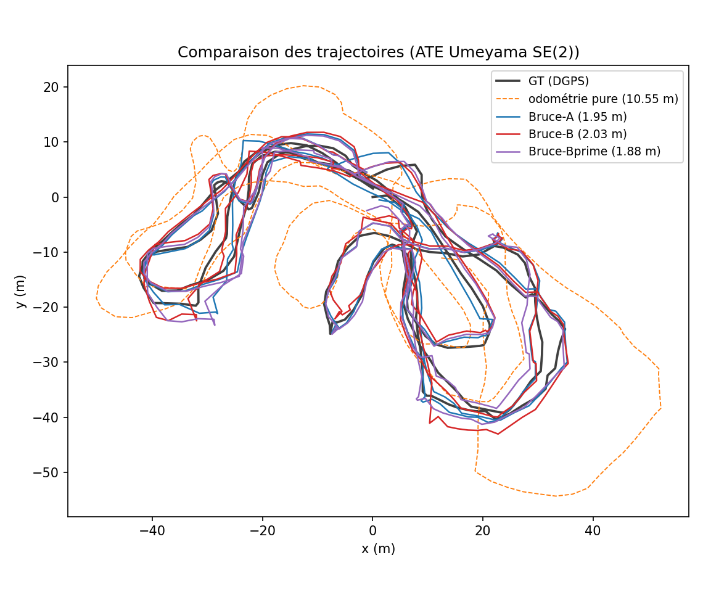
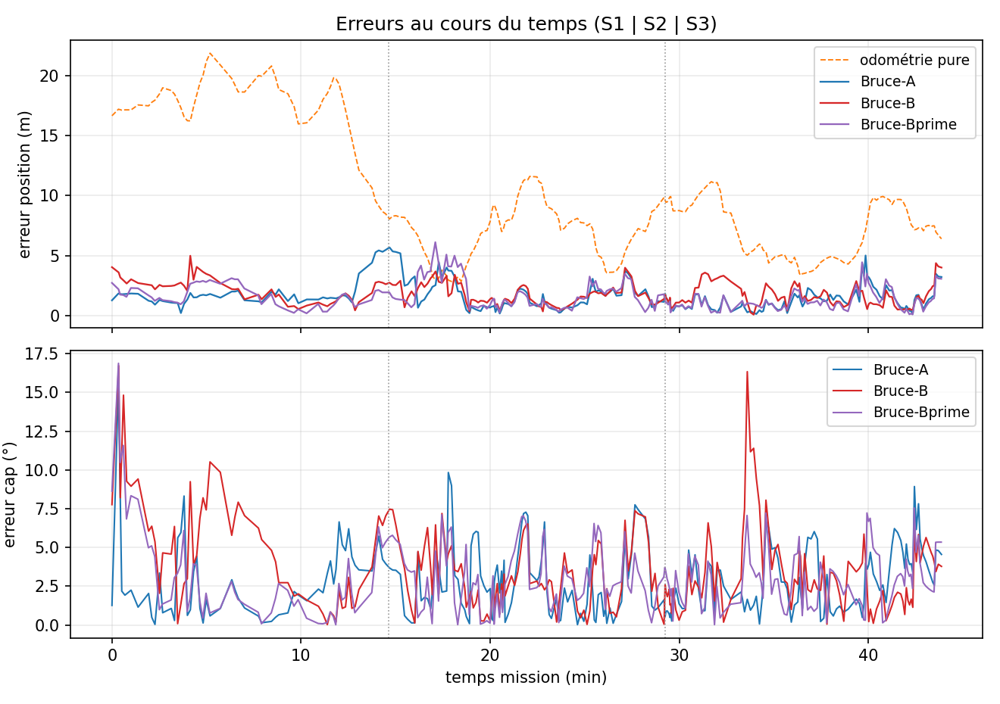

# Bruce-SLAM original sur Aracati2017 : adaptation « GT-free » et améliorations

**Titre :** *Déploiement du Bruce-SLAM original sur le dataset réel Aracati2017 sans vérité
terrain : ce qu'il a fallu corriger, ce que ça donne, et ce qui reste à prendre*
**Auteur :** Nathan Rasamijaona — stage 4A, Polytechnique (électronique), 2026
**Branche :** `Bruce` — ce document décrit **cette branche uniquement** : le pipeline upstream
[1] (SSM + NSSM + iSAM2) conservé à l'identique, plus le strict nécessaire pour qu'il tourne
en conditions réelles. La variante avec place recognition (branche `Bruce_Sonar_USBL`) est
décrite dans `Paper/MiniPapier/MINI_PAPIER.md`.
**Public :** pensé pour servir de point d'entrée à quiconque travaille sur le Bruce-SLAM
original (upstream https://github.com/jake3991/sonar-SLAM) et veut le faire tourner sur un
dataset tiers.

---

## Résumé

Bruce-SLAM [1] est un SLAM 2D temps réel à sonar imageur frontal, développé et validé par ses
auteurs sur leurs propres données (BlueROV2, messages OculusPing, odométrie DVL/IMU embarquée).
Le porter sur Aracati2017 [4] — images cartésiennes d'un BlueView P900, pas de DVL, vérité
terrain interdite à l'exécution — révèle trois manques que ce document décrit et corrige :
**(i)** une odométrie d'entrée à reconstruire (intégration des consignes `/cmd_vel`, amorcée
USBL) ; **(ii)** un **bug de chiralité** entre le repère des features et celui de l'odométrie,
qui détruisait la carte (« tourbillon ») et la détection de boucles (6 contraintes PCM au lieu
de 130) ; **(iii)** un ancrage global absent, ajouté sous forme de **facteurs USBL robustes**
dans le graphe. Le pipeline upstream lui-même (CFAR, keyframes, ICP, SSM, NSSM, PCM, iSAM2)
n'est **pas modifié**. Résultat sur la mission complète (44 min, ~1.5 km) : **ATE 1.88 m**
(alignement Umeyama SE(2), sans échelle), cap médian 2.6°, carte à 0.09 m (médiane) de la
carte re-rendue aux poses GT — contre 10.6 m pour l'odométrie seule. Une ablation à trois
runs isole la contribution de chaque ajout, et le chapitre VI liste les améliorations encore
disponibles sur cette branche, dont la densification des keyframes (la trajectoire actuelle
est « géométrique » : 256 keyframes espacées de ~3 m, réglage upstream).

---

## I. Introduction

### 1.1 Point de départ et règle du jeu

L'upstream fonctionne clé en main sur les bags de ses auteurs : odométrie DVL/IMU propre,
sonar polaire Oculus, environnements où les revisites sont franches. Aracati2017 casse ces
trois confort : l'odométrie du bord est une **consigne** de vitesse (pas une mesure), le sonar
est un P900 basse résolution livré en **images cartésiennes**, et la seule position absolue
utilisable en opération est un **USBL** bruité. Contrainte de tout le stage : le DGPS de
vérité terrain (`/pose_gt`) ne sert **qu'à l'évaluation** — jamais à l'exécution. Nuance
déclarée : la vitesse angulaire de `/cmd_vel` est dérivée du **compas** du véhicule (README
du dataset [4]) ; un compas est un capteur embarqué légitime, mais il faut le savoir en
lisant les erreurs de cap (§ 5.2).

### 1.2 Ce que ce document contient

- chap. II : rappel du pipeline original et de ce qui est **inchangé** ;
- chap. III : les modifications, une par une, avec formules et fichiers touchés —
  c'est la section à lire pour transposer ces corrections à une autre base de code ;
- chap. IV : l'ablation A/B/B′ (que vaut chaque ajout) ;
- chap. V : les résultats complets (protocole d'évaluation partagé avec
  `Paper/MiniPapier/MINI_PAPIER.md` § 6.2, qui justifie chaque métrique) ;
- chap. VI : les améliorations restantes identifiées sur cette branche ;
- chap. VII : comment reproduire chaque run.

---

## II. Le système original (inchangé)

Chaîne upstream [1], conservée à l'identique sur cette branche :

1. **Extraction de features** : détecteur SOCA-CFAR sur l'image sonar → points « structure ».
2. **Keyframes** : nouvelle keyframe au-delà d'un seuil de déplacement — réglage upstream
   conservé : `keyframe_translation: 3.0` m (le commentaire upstream indique « between 1 and
   4 meters is best »), `keyframe_duration: 1.0` s, rotation 30°. Conséquence assumée :
   **256 keyframes** sur la mission (cf. § 6.1).
3. **Odométrie sonar séquentielle** : ICP scan-à-scan initialisé par l'odométrie, fusionné
   avec elle en facteurs relatifs.
4. **SSM** (*Sequential Scan Matching*) : recalage court-terme multi-frames qui raidit le cap
   local.
5. **NSSM** (*Non-Sequential Scan Matching*) = fermetures de boucle : présélection
   géométrique (covariance + recouvrement), initialisation globale de l'ICP par l'optimiseur
   **shgo**, validation par cohérence par paires **PCM** [2] (fenêtre 5, min 6 cohérents).
6. **Back-end** : graphe de facteurs, optimisation incrémentale **iSAM2** [5].

Aucun de ces modules n'est modifié. Les yaml de la branche portent l'annotation « identique
au Bruce-SLAM ORIGINAL » pour chaque bloc conservé.

---

## III. Les modifications par rapport à l'upstream

### 3.1 Odométrie d'entrée : intégration de `/cmd_vel` amorcée USBL

L'upstream consomme une odométrie DVL/IMU (`dead_reckoning.py`/`kalman.py`) qu'Aracati n'a
pas. Nous la remplaçons par l'intégration unicycle des consignes du bord :

$$\theta_{k+1} = \theta_k + \omega_{z,k}\,\Delta t_k, \qquad
\mathbf{p}_{k+1} = \mathbf{p}_k + v_{x,k}\,\Delta t_k\,[\cos\theta_k,\ \sin\theta_k]^\top$$

avec $(\mathbf{p}_0, \theta_0)$ estimés par la route-fond des premiers fixes USBL (aucune GT).
Propriétés mesurées : cap excellent ($\omega_z$ vient du compas → erreur de rotation relative
~0 °/m), translation qui dérive fortement (consigne ≠ vitesse réelle : **10.6 m** d'ATE seule).
Le rôle du SLAM est donc de corriger la translation sans dégrader le cap.
*Fichiers : `bruce_slam/scripts/cmd_vel_odom.py` (nouveau), branchement dans
`aracati.launch`.*

### 3.2 La correction de chiralité (le déblocage)

**Symptôme.** Carte en « tourbillon » : scans individuellement nets mais peints en arcs
incohérents en virage — trajectoire pourtant correcte. Et surtout : NSSM quasi mort
(6 contraintes PCM sur toute la mission).

**Cause.** Les features cartésiennes étaient extraites avec le $y$ latéral orienté à droite
(repère **indirect**), l'odométrie du § 3.1 produisant des poses en repère **direct**. Avec
$M = \mathrm{diag}(1,-1)$ :

$$\mathbf{p}_w = R(\theta_k)\,M\,\mathbf{p}_l + \mathbf{t}_k
             = M\,R(-\theta_k)\,\mathbf{p}_l + \mathbf{t}_k$$

l'identité $R(\theta)M = MR(-\theta)$ montre que chaque scan est rendu comme dans un monde
en miroir **avec le cap opposé** : les scans tournent à contre-sens du véhicule. Deux scans
d'une même revisite ne diffèrent alors plus par une transformation rigide directe → l'ICP de
boucle échoue **silencieusement**, le PCM n'a rien à valider. Le bug est invisible dans les
métriques de trajectoire : seule la carte (et le compte de boucles) le trahit.

**Correction.** Paramètre `cartesian/flip_bearing` (nouveau) : inverse le $y$ latéral à
l'empaquetage des features. `True` pour toute odométrie directe (cmd_vel), `False` conservé
pour le mode DISO (repère indirect natif). **Validation** à données et config identiques :
auto-cohérence du nuage 0.365 → 0.203 m, contraintes PCM **6 → 82** (puis 130 en config B′),
le quai en T devient lisible.
*Fichiers : `bruce_slam/src/bruce_slam/feature_extraction.py` (~5 lignes),
`bruce_slam/config/feature_aracati.yaml`. Piège documenté : le flip doit s'appliquer APRÈS la
relecture d'intensité (`PIEGES.md` §1).*


*Fig. 1 — Même run, mêmes poses : nuage avant (« tourbillon ») et après dé-miroitage des
scans.*

### 3.3 Ancrage global : facteurs USBL dans le graphe

Sans position absolue, la dérive résiduelle de l'odométrie n'est bornée par rien sur 44 min.
Chaque fix USBL $\mathbf{u}_i$ (associé à la keyframe la plus proche si $|t_i - t_k| \le 1$ s,
gating de vitesse 3 m/s contre les pings aberrants à ~73 m) devient un **facteur unaire
robuste sur la position seule** :

$$\phi_i(\mathbf{X}) = \rho_c\!\left(\frac{\lVert \Pi\,\mathbf{X}_{k(i)} - \mathbf{u}_i \rVert}{\sigma_{\text{usbl}}}\right),
\qquad \rho_c(r) = \tfrac{c^2}{2}\,\log\!\left(1 + \tfrac{r^2}{c^2}\right)$$

($\Pi$ = projection sur $(x,y)$ ; noyau de Cauchy : les outliers saturent). Le cap n'est
**pas** contraint : il appartient à l'odométrie, au SSM et aux boucles. Deux réglages
non évidents, mesurés au chap. IV :

- $\sigma_{\text{usbl}} = 2.5$ m (**doux**) sur cette branche : les modules natifs SSM/NSSM
  contraignent déjà fortement, une ancre raide ($\sigma = 1.0$) se dispute la trajectoire
  avec eux et **dégrade** (2.03 m vs 1.88 m) ;
- ne **jamais** cumuler cet ancrage back-end avec la correction USBL du front-end
  (double ancrage contradictoire : ATE 1.45 → 4.66 m mesuré, `PIEGES.md` §2).

*Fichiers : `slam_ros.py`/`slam.py` (facteurs + association), `slam_aracati.yaml` (bloc
`usbl`), variables d'env `USBL_BACKEND`/`USBL` dans `run_slam.sh`.*

### 3.4 Plafond des bornes shgo (fiabilisation NSSM)

Détail d'implémentation indispensable en GT-free : sans boucle précoce, la covariance
accumulée gonfle les bornes de recherche de l'init globale shgo jusqu'à ±130 m → shgo ne
converge plus → zéro boucle (cercle vicieux). Bornes plafonnées à **±20 m** / ±180°
(`nssm/shgo_max_translation`), ce qui couvre toute dérive locale réaliste d'une revisite.

### 3.5 Exports et outillage d'évaluation

Ajoutés pour rendre les runs comparables (aucun effet sur le SLAM) : export CSV
(trajectoire + dead-reckoning `dr_*` + `nssm_constraints` par keyframe, GT horodatée avec cap
compas, nuage avec keyframe d'origine), scripts `analysis/` partagés entre branches
(`traj_eval.py` Umeyama, `bilan_run.py` 1 image/run, `paper_eval.py` protocole complet du
chap. V), point d'entrée unique `./analyse.sh <run>`.

**Récapitulatif des écarts à l'upstream :**

| Fichier | Modification | § |
|---|---|---|
| `scripts/cmd_vel_odom.py` | nouveau — odométrie consignes + seed USBL | 3.1 |
| `src/.../feature_extraction.py` | param `flip_bearing` (chiralité) | 3.2 |
| `config/feature_aracati.yaml` | `flip_bearing: True` | 3.2 |
| `slam_ros.py` / `slam.py` | facteurs USBL Cauchy + exports CSV | 3.3, 3.5 |
| `config/slam_aracati.yaml` | bloc `usbl`, `shgo_max_*` ; cœur upstream inchangé | 3.3, 3.4 |
| `aracati.launch` / `run_slam.sh` | câblage odométrie, args SSM/NSSM/USBL | 3.1, 3.3 |

---

## IV. Ablation : que vaut chaque ajout ?

Trois runs contrôlés, chaîne §3.1–3.2 identique partout, un seul facteur varie
(protocole détaillé : `ABLATION.md`) :

| Run | Config | ATE (m) | RE trans (%) | Carte méd/p90 (m) | Boucles PCM |
|---|---|---|---|---|---|
| A (`194559`) | SSM + NSSM, **sans** ancrage USBL | 1.95 | **5.89** | **0.09 / 0.67** | ~110 |
| B (`204329`) | A + USBL $\sigma = 1.0$ (raide) | 2.03 | 8.64 | 0.10 / 0.86 | ~120 |
| **B′** (`120352-1`) | A + USBL $\sigma = 2.5$ (doux) | **1.88** | 9.25 | 0.09 / 0.74 | **130** |

Lectures :

- **Le fix de chiralité est le vrai héros** : il précède les trois runs (sans lui, 6
  contraintes PCM et une carte illisible — aucune config ne rattrape ça).
- **L'ancrage aide si et seulement s'il est doux** : B (raide) est *pire* que A (sans ancre) ;
  B′ (doux) gagne 0.07 m sur A. Les modules natifs laissent peu de place à l'ancre.
- **A garde la meilleure carte locale** (p90 0.67) et la meilleure cohérence relative
  (RE 5.89 %) : l'ancre améliore le global (ATE) au prix d'un léger bruit local — le
  compromis est réglable par $\sigma$, pas gratuit.



*Fig. 2 — A, B, B′ vs GT et odométrie pure (alignement Umeyama SE(2)).*



*Fig. 3 — Erreur de position et de cap au cours de la mission (bornes S1|S2|S3).*

---

## V. Résultats complets (config champion B′)

Protocole : identique au chap. VI du mini-papier (`Paper/MiniPapier/MINI_PAPIER.md` § 6.2),
qui justifie chaque choix — ATE primaire = **Umeyama SE(2) sans échelle** [3] ; sections
S1/S2/S3 = tiers temporels analogues aux 3 séquences de DISO ; RE = erreurs relatives sur
segments de 10 % ; erreur de carte = distance au nuage re-rendu aux poses GT (mêmes
détections). Chiffres reproduits par `python3 analysis/paper_eval.py <run>`.

| Métrique | Odométrie pure | **B′ (cette branche)** | Réf. assistée GT (borne) |
|---|---|---|---|
| ATE Umeyama SE(2) (m) | 10.61 | **1.88** | 0.89 |
| ATE par section S1/S2/S3 (m) | — | 1.53 / 2.24 / 1.31 | 0.49 / 1.18 / 0.57 |
| ATE première-pose (m) | 20.15 | 3.49 | 1.64 |
| RE translation (%) | 32.5 | 9.25 | 2.42 |
| RE rotation (°/m) | 0.002 | 0.067 | 0.053 |
| Cap médian (°) | ~0 (compas) | 2.6 | 1.6 |
| Carte vs vraie méd/p90 (m) | — | 0.09 / 0.74 | 0.11 / 0.40 |

### 5.1 Lecture

Le Bruce-SLAM original, une fois débloqué (chiralité) et ancré (USBL doux), fait le travail :
÷5.6 sur l'ATE de l'odométrie, une carte juste à 9 cm (médiane), 130 boucles validées PCM.
La borne assistée-GT (0.89 m) rappelle que la « GT » est un DGPS sur planche flottante : il
reste ~1 m à prendre, pas 1.88.


*Fig. 4 — Nuage B′ superposé au nuage re-rendu aux poses GT (gauche) et coloré par l'erreur
de carte (droite) : méd 0.09 m, p90 0.74 m.*

### 5.2 Mise en garde de lecture

L'erreur de rotation quasi nulle de l'odométrie n'est pas un exploit : $\omega_z$ dérive du
compas du bord [4]. Toutes les méthodes de ce tableau partent du même excellent cap et se
départagent sur la **translation** — même régime que les baselines « Odom+Mag » de
DISO/ISOPoT. Toute comparaison avec des méthodes « sonar seul » doit le déclarer.

### 5.3 Et par rapport à la branche Sonar Context ?

À capteurs strictement identiques, la branche `Bruce_Sonar_USBL` (détection de boucles par
apparence au lieu de la présélection covariance du NSSM) atteint **1.50 m** (−0.38 m) — voir
le mini-papier. La branche `Bruce` reste la référence « original réparé » : c'est elle qui
mesure ce que vaut l'upstream seul, et c'est la base saine pour toute amélioration destinée
à être reversée à l'upstream.

---

## VI. Améliorations restantes sur cette branche

### 6.1 Trajectoire « géométrique » : densifier les keyframes

La trajectoire B′ a un aspect polygonal : **256 keyframes** espacées de ~3 m
(`keyframe_translation: 3.0`, réglage upstream), reliées par des segments droits — la branche
`Bruce_Sonar_USBL` en a 665 avec le même critère à 1.0 m. Recette :

- `slam_aracati.yaml` : `keyframe_translation: 3.0 → 1.0` (reste dans la plage « 1 à 4 m »
  recommandée par l'upstream). Attendu : trajectoire lissée (×2.6 keyframes), rendu du nuage
  depuis plus de poses, ATE évaluée sur plus de points ; coût : ~×2.6 de charge ICP/NSSM
  (marge CPU disponible, BSU tourne déjà ainsi). Risque faible ; 1 run de validation vs B′.
- Alternative sans run (post-traitement) : densifier la trajectoire exportée en composant le
  dead-reckoning entre keyframes, $\mathbf{p}(t) = \mathbf{p}_k \oplus
  (\mathrm{dr}(t) \ominus \mathrm{dr}(t_k))$ — lisse l'affichage, ne change pas le SLAM.

### 6.2 Rendu de carte au cap compas (gain surtout côté BSU)

Re-rendre chaque scan à la position optimisée mais au **cap compas recalé**
($\theta^{\text{rendu}}_k = \mathrm{dr}\theta_k + \delta$, $\delta$ = moyenne circulaire de
$\theta_k - \mathrm{dr}\theta_k$, 100 % GT-free — `analysis/render_compass_cloud.py`).
Mesuré : sur B′ le gain est marginal (p90 0.74 → 0.64 ; le SSM tient déjà le cap local) ;
sur la trajectoire BSU il est spectaculaire (p90 0.99 → **0.44**, la borne GT). C'est la
piste U1 de la nouvelle branche `Bruce_Ultime`.

### 6.3 Autres pistes

$\sigma_{\text{usbl}}$ **adaptatif par fix** (covariance par la qualité du fix, correntropie
maximale — Sensors 2023 [6]) : supprimerait le réglage manuel doux/raide du chap. IV.
Seuils NSSM (min_pcm, fenêtre) post-fix jamais re-balayés sur cette branche. Densification
CFAR (plus de points par scan) si la carte devient le livrable prioritaire.

---

## VII. Reproduire — avec ou sans USBL (meilleure config de chaque mode)

Les deux modes utiles, chacun avec sa meilleure configuration mesurée. Dans les deux cas
le run s'arrête seul à la fin du bag (~45 min) et les prérequis du chap. III restent
nécessaires (fix de chiralité §3.2 + odométrie cmd_vel §3.1 — sans eux : carte en
tourbillon et 6 loops, USBL ou pas).

### 7.1 SANS USBL — Bruce-SLAM original pur (= le cas d'étude « upstream seul »)

```bash
git checkout Bruce
SSM=true NSSM=true USBL=false ./run_slam.sh
```

= **le run A** (`run_aracati_2026-07-02_194559`) : **ATE 1.95 m**, RE trans 5.89 %,
carte vs vraie **0.09/0.67** (la meilleure carte de la branche), ~110 loops natives.
Répétabilité : A-bis (`214846`) donne 2.04 — l'ICP non seedé fait varier de ±0.1 m.
Zéro USBL nulle part : pas de facteurs back-end, pas de fusion front-end, odométrie
amorcée à (0,0,0) — le repère absolu n'importe pas, l'évaluation aligne par Umeyama.
C'est la configuration à comparer pour tout travail sur l'upstream : la seule entorse
à l'original est l'odométrie d'entrée (Aracati n'a ni DVL ni IMU exploitables).

### 7.2 AVEC USBL — champion de la branche (ancre douce)

```bash
git checkout Bruce
SSM=true NSSM=true USBL=true USBL_GAIN=0 USBL_BACKEND=true ./run_slam.sh
```

= **le run B′** (`120352-1`) : **ATE 1.88 m**, 130 loops, carte 0.09/0.74. Le σ = 2.5
(doux) est déjà dans le yaml — ne rien éditer. **`USBL_GAIN=0` est obligatoire** : sans
lui l'USBL agit aussi dans le front-end → double ancrage → zigzag (ATE 4.66, PIEGES §2).
À retenir : l'ancre n'apporte que **0.07 m** ici (1.95 → 1.88) car SSM/NSSM contraignent
déjà beaucoup — et raide (σ1.0, run B) elle DÉGRADE (2.03). L'apport de l'USBL est bien
plus net quand la détection de boucles est plus sélective (branche `Bruce_Sonar_USBL` :
1.50 avec σ1.4 ; branche `Bruce_Ultime` : 1.47 avec σ1.8).

### 7.3 Évaluation (commune)

```bash
./analyse.sh run_aracati_<date>                       # bilan 1 image + carte compas auto
python3 analysis/paper_eval.py results/run_aracati_<date>   # protocole complet chap. V
```

Note RViz : en fin de run la carte affichée est « épaisse » — les scans des passages
successifs se superposent avec leur drift résiduel (~0.1-0.7 m, cf. métrique carte).
C'est attendu ; la carte fine est le produit offline (`pointcloud_compass.csv/png`,
généré par `analyse.sh`). **Lire `PIEGES.md` avant toute modification** (chiralité §1,
double ancrage §2, un run à la fois §4, fenêtres NSSM en keyframes §11).

---

## Références

[1] J. Wang, F. Chen, Y. Huang, J. McConnell, T. Shan, B. Englot, *Virtual Maps for
Autonomous Exploration of Cluttered Underwater Environments*, IEEE J. Oceanic Eng., 2022 —
le SLAM sous-jacent est le Bruce-SLAM utilisé ici (upstream jake3991/sonar-SLAM).
arXiv:2202.08359.
[2] J. Mangelson et al., *Pairwise Consistent Measurement Set Maximization for Robust
Multi-robot Map Merging*, ICRA 2018.
[3] S. Umeyama, *Least-Squares Estimation of Transformation Parameters Between Two Point
Patterns*, IEEE TPAMI, 1991.
[4] M. dos Santos et al., dataset ARACATI 2017 — https://github.com/matheusbg8/aracati2017.
[5] M. Kaess et al., *iSAM2: Incremental Smoothing and Mapping Using the Bayes Tree*,
IJRR 2012.
[6] *A Robust INS/USBL/DVL Integrated Navigation Algorithm Using Graph Optimization*,
Sensors 23(2):916, 2023.
