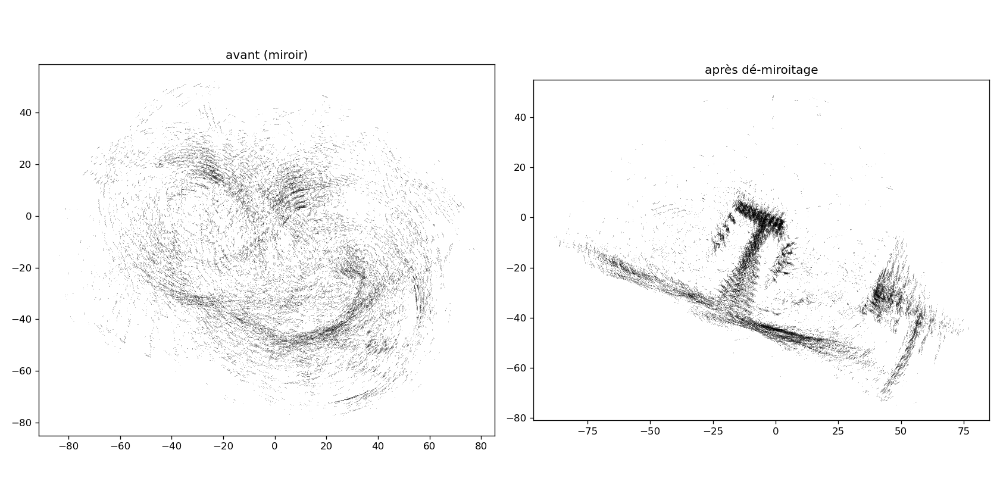
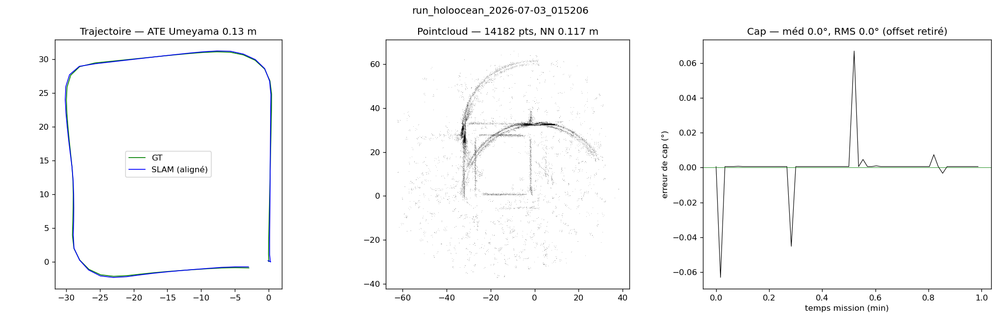
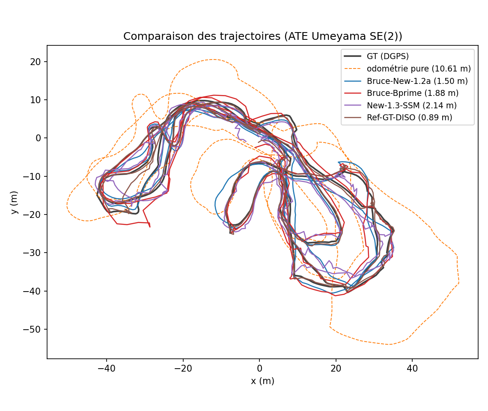
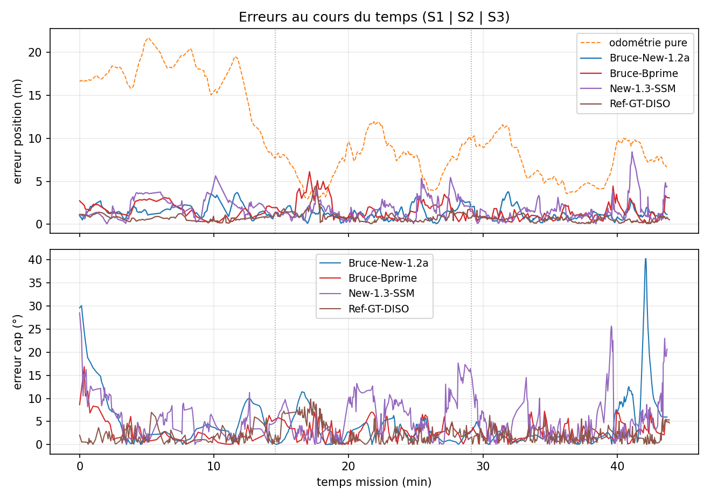
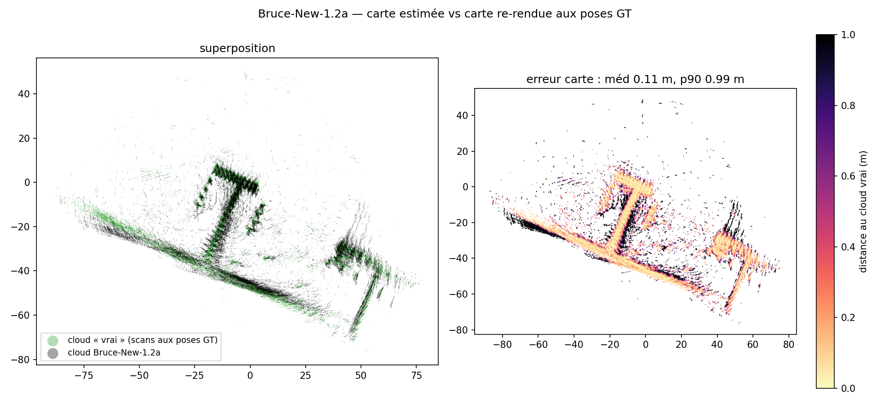
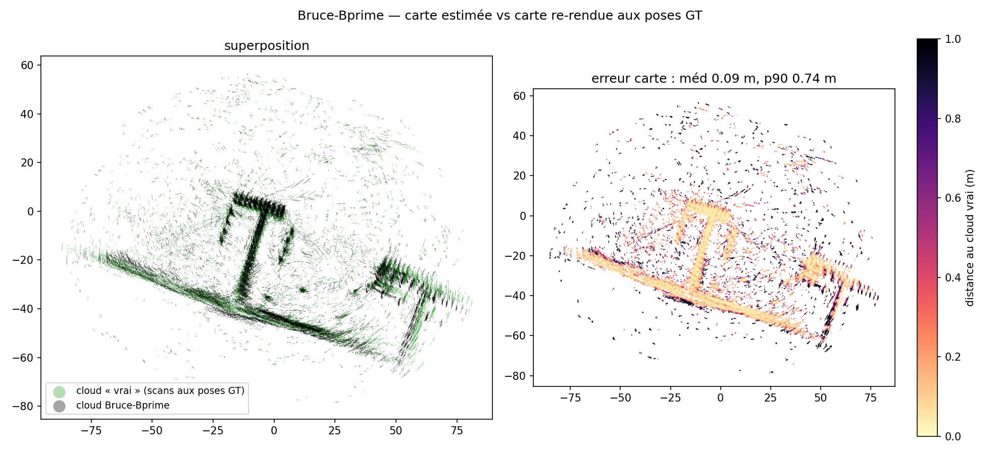

# Bruce-New : SLAM sonar 2D « GT-free » ancré USBL sur Aracati2017

**Titre :** *Cartographie et localisation sous-marines par sonar frontal sans vérité terrain :
correction de chiralité, ancrage USBL et place recognition Sonar Context sur le dataset Aracati2017*
**Auteur :** Nathan Rasamijaona — stage 4A, Polytechnique (électronique), 2026
**Base logicielle :** Bruce-SLAM [1] (fork) — https://github.com/nathanrasami/sonar-SLAM
**Branches :** `Bruce` (méthode de base, chap. II) · `Bruce_Sonar_USBL` (méthode proposée, chap. III) ·
`holoocean` (simulation, chap. V) — configurations champion figées dans les yaml de chaque branche.

---

## Résumé

Nous adaptons le système Bruce-SLAM [1] (SLAM 2D à sonar imageur frontal) au dataset réel
Aracati2017 [8] sous une contrainte stricte : **n'utiliser que des capteurs disponibles sur un
véhicule sous-marin en opération** (sonar BlueView P900, odométrie du bord, positionnement
acoustique USBL) — jamais la vérité terrain DGPS, réservée à l'évaluation. Trois obstacles ont
dû être levés : (i) un **bug de chiralité** entre le repère des scans sonar et celui de
l'odométrie, qui transformait la carte en « tourbillon » et cassait silencieusement la détection
de boucles ; (ii) l'absence d'odométrie fiable, résolue par l'intégration des consignes de
vitesse du bord ancrée par des **facteurs USBL robustes** dans le graphe de facteurs ; (iii) la
rareté des fermetures de boucle, résolue en remplaçant la détection géométrique de Bruce-SLAM
par une **place recognition par apparence** dérivée de Sonar Context [2], adaptée au P900.
Sur la mission complète (44 min, ~1.5 km), la méthode proposée atteint une **ATE de 1.50 m**
(Umeyama SE(2), sans échelle) et une **erreur de cap médiane de 2.6°**, contre 1.88 m pour le
meilleur Bruce-SLAM « pur » à capteurs identiques, 10.6 m pour l'odométrie seule et 0.89 m pour
une référence assistée par vérité terrain. Nous introduisons également une **métrique de carte**
(distance du nuage estimé au nuage re-rendu aux poses GT) : la carte GT-free est à
**0.11 m (médiane)** de la carte vraie. Le protocole d'évaluation est aligné sur celui de
DISO [3]/ISOPoT [4] (sections S1/S2/S3, erreurs relatives) et ses choix sont justifiés.

---

## I. Introduction

### 1.1 Contexte et contrainte « GT-free »

Sous l'eau, ni GPS ni caméra exploitable en eau turbide : le sonar imageur frontal (FLS) est
souvent le seul capteur extéroceptif dense. Bruce-SLAM [1] démontre un SLAM 2D temps réel à
partir d'un FLS, mais son déploiement sur un dataset réel tiers expose des hypothèses
implicites (conventions de repères, odométrie de qualité, revisites détectables).

La règle du jeu de ce travail : **le résultat final doit être obtenable sur un vrai véhicule**.
Sont autorisés le sonar, l'odométrie du bord et l'USBL (positionnement acoustique standard en
opération). Sont interdits le DGPS de vérité terrain (`/pose_gt`) et tout capteur « de
laboratoire ». Nuance assumée et documentée : la vitesse angulaire de l'odométrie du bord
d'Aracati2017 est **dérivée du compas magnétique du véhicule** (README du dataset [8]) — un
compas est bien un capteur embarqué légitime ; la conséquence (cap odométrique quasi exact,
erreur de rotation relative ≈ 0) est la même que pour les baselines « Odom+Mag » de
DISO [3] et ISOPoT [4], et nous la signalons partout où elle avantage une métrique.

### 1.2 Le dataset Aracati2017

Marina de Rio Grande (Brésil), ROV LBV300-5 sous une planche flottante portant un DGPS
(vérité terrain de position) : sonar **BlueView P900-130** (130° FOV, portée 50 m, images
cartésiennes), consignes de vitesse `/cmd_vel`, fixes USBL `/usbl_point`, compas. Mission de
44 min (~1.5 km) le long d'un quai en T et de pontons. Dataset réputé difficile (artefacts de
réflexion, zones surexposées, cf. l'analyse d'ISOPoT [4]) ; DISO [3] et ISOPoT [4] l'utilisent
comme banc d'essai, ce qui permet une lecture croisée de nos chiffres (§ 6.2).

### 1.3 Contributions

1. **Diagnostic et correction d'un bug de chiralité** entre les features sonar et l'odométrie
   (§ 2.3) : identité $R(\theta)M = MR(-\theta)$ expliquant le « tourbillon » observé, fix en
   1 paramètre, validation quantitative (auto-cohérence du nuage 0.365 → 0.203 m ; contraintes
   de boucle PCM 6 → 82).
2. **Chaîne odométrique GT-free** : intégration unicycle des consignes `/cmd_vel` + **facteurs
   unaires USBL robustes (noyau de Cauchy)** dans le graphe iSAM2 (§ 2.2, § 2.4).
3. **Détection de boucles par apparence** : Sonar Context [2] ré-dérivé pour le P900 basse
   résolution (descripteur densité-au-dessus-du-seuil au lieu du max-pooling, AUC 0.55 → 0.86),
   avec porte géométrique et calibration de seuil par bilan vrais/faux candidats (§ III).
4. **Protocole d'évaluation explicité et métrique de carte** : comparaison des variantes d'ATE
   (Umeyama SE(2), sim(2), première-pose), sections S1/S2/S3, erreurs relatives type
   DISO/ISOPoT, et une métrique nouvelle pour ce pipeline : distance du nuage estimé au nuage
   re-rendu aux poses GT (§ VI).
5. **Comparaison contrôlée** meilleur Bruce-SLAM pur vs méthode proposée, à capteurs
   identiques : 1.88 m vs 1.50 m, et la leçon transversale « le σ d'ancrage optimal dépend du
   pipeline » (§ 6.6), qui rejoint la littérature des facteurs USBL adaptatifs [5].

---

## II. Méthode de base : Bruce-SLAM adapté (branche `Bruce`)

### 2.1 Rappel du pipeline Bruce-SLAM [1]

Le front-end extrait des points « structure » de chaque image sonar par un détecteur
**SOCA-CFAR** ; les scans successifs sont agrégés en **keyframes** (créées au-delà d'un seuil de
déplacement) et recalés par **ICP** séquentiel initialisé par l'odométrie. Le back-end est un
graphe de facteurs optimisé par **iSAM2** [9]. Les fermetures de boucle « non séquentielles »
(NSSM) sont détectées géométriquement : présélection par covariance et recouvrement estimé,
initialisation globale de l'ICP par l'optimiseur **shgo**, validation par la cohérence par
paires **PCM** [6]. Un module SSM (recalage court terme multi-frames) affine l'odométrie.
Nous conservons l'intégralité de cette architecture ; les paragraphes suivants décrivent ce
que nous avons dû **ajouter** pour qu'elle fonctionne en GT-free sur Aracati2017.

### 2.2 Odométrie GT-free : intégration de `/cmd_vel`

Aracati2017 ne fournit pas d'odométrie inertielle exploitable ; nous intégrons les consignes de
vitesse du bord (modèle unicycle plan) :

$$\theta_{k+1} = \theta_k + \omega_{z,k}\,\Delta t_k, \qquad
\mathbf{p}_{k+1} = \mathbf{p}_k + v_{x,k}\,\Delta t_k\,[\cos\theta_k,\ \sin\theta_k]^\top$$

avec l'amorçage $(\mathbf{p}_0, \theta_0)$ estimé par la route-fond des premiers fixes USBL
(aucune GT). Comme $\omega_z$ est dérivée du compas [8], le **cap** intégré est précis
(erreur de rotation relative ≈ 0 °/m, § 6.3) mais la **translation** dérive fortement
(consignes ≠ vitesses réelles ; courants) : 10.6 m d'ATE en fin de mission. Tout l'enjeu du
back-end est de corriger cette translation sans toucher au cap.

### 2.3 Le bug de chiralité et sa correction

**Symptôme.** Carte en « tourbillon » : chaque scan individuellement net, mais les scans
successifs peints en arcs incohérents dès que le véhicule tourne — alors que la trajectoire,
elle, est correcte.

**Cause.** Les features cartésiennes étaient extraites avec l'axe latéral $y$ orienté
**à droite** (convention héritée du mode DISO du fork, repère indirect), tandis que
l'odométrie `/cmd_vel` produit des poses en repère **direct** ($\det = +1$). Soit
$M = \mathrm{diag}(1, -1)$ le miroir latéral et $\mathbf{p}_l$ un point du scan en repère
capteur. Le rendu monde applique alors :

$$\mathbf{p}_w = R(\theta_k)\,M\,\mathbf{p}_l + \mathbf{t}_k
             = M\,R(-\theta_k)\,\mathbf{p}_l + \mathbf{t}_k$$

par l'identité $R(\theta)M = MR(-\theta)$ : tout se passe comme si chaque scan était rendu
dans un monde en miroir **avec un cap opposé** au cap réel. Les scans tournent à contre-sens
du véhicule → arcs, « tourbillon », et surtout **échec silencieux de l'ICP de boucle** (les
nuages source et cible d'une revisite ne sont pas superposables par une transformation rigide
directe).

**Correction.** Un paramètre `cartesian/flip_bearing` inverse le $y$ latéral au moment de
l'empaquetage des features ($\chi = +1$ pour l'odométrie directe `/cmd_vel`, $\chi = -1$
conservé pour DISO). **Validation** (mêmes données, même config) : auto-cohérence du nuage
(distance médiane au plus proche voisin, 8000 points) **0.365 → 0.203 m**, contraintes de
boucle acceptées par PCM **6 → 82**, le quai en T devient lisible. C'est le déblocage dont
dépendent tous les résultats de ce document.

*Fig. 1 — Le nuage d'un même run avant (gauche : « tourbillon ») et après (droite)
dé-miroitage des scans. Aucune pose n'a changé : seule la chiralité du rendu.*

### 2.4 Ancrage USBL dans le graphe de facteurs

L'USBL fournit des fixes de position absolue $\mathbf{u}_i$ bruités (multitrajets, pings
aberrants à ~73 m près du transpondeur). Chaque fix est associé à la keyframe la plus proche
en temps ($|t_i - t_k| \le 1$ s, gating de vitesse 3 m/s) et ajouté comme **facteur unaire
robuste sur la position seule** (le cap reste à l'odométrie et aux boucles) :

$$\phi_i(\mathbf{X}) = \rho_c\!\left(\frac{\lVert \Pi\,\mathbf{X}_{k(i)} - \mathbf{u}_i \rVert}{\sigma_{\text{usbl}}}\right),
\qquad \rho_c(r) = \tfrac{c^2}{2}\,\log\!\left(1 + \tfrac{r^2}{c^2}\right)$$

où $\Pi$ projette la pose sur $(x, y)$ et $\rho_c$ est le noyau de Cauchy (les outliers
saturent au lieu de tirer la solution). Le réglage de $\sigma_{\text{usbl}}$ s'est révélé
**dépendant du pipeline aval** (§ 6.6). Piège documenté : activer *à la fois* la correction
USBL du front-end et ces facteurs back-end constitue un double ancrage contradictoire
(ATE 1.45 → 4.66 m mesuré).

### 2.5 Ablation de la branche `Bruce` (Bruce-SLAM pur)

Trois runs contrôlés, chaîne capteurs identique (fix de chiralité + odométrie § 2.2 partout) :

| Run | Config | ATE (m) |
|---|---|---|
| A | SSM + NSSM natifs, sans ancrage USBL back-end | 1.95 |
| B | A + facteurs USBL, $\sigma = 1.0$ (raide) | 2.03 |
| **B′** | A + facteurs USBL, $\sigma = 2.5$ (doux) | **1.88** |

Le meilleur Bruce-SLAM pur (B′, 130 contraintes de boucle NSSM) sert de **référence à battre**
au chapitre VI. Noter que l'ancre raide (B) *dégrade* : les modules natifs SSM/NSSM contraignent
déjà fortement la trajectoire, l'ancre doit rester douce — première manifestation de la leçon
du § 6.6.

---

## III. Méthode proposée : Bruce-New (branche `Bruce_Sonar_USBL`)

Le goulot restant de Bruce-SLAM pur est la **détection** des revisites : la présélection par
covariance devient aveugle dès que l'incertitude accumulée gonfle. Nous remplaçons cette
détection par une place recognition **par apparence**, en conservant toute la vérification
géométrique aval (shgo + ICP + PCM) — la contribution est chirurgicale.

### 3.1 Descripteur : Sonar Context ré-dérivé pour le P900

Sonar Context [2] encode l'image sonar polaire en une matrice azimut × range par max-pooling
d'intensité. Sur le P900 d'Aracati (basse résolution, fond marin brillant, saturations), le
max-pooling sature partout : descripteur non discriminant (**AUC 0.55**, mesuré sur un banc de
paires vraies/fausses revisites). Notre variante encode la **densité de retours structurels** :
l'image repolarisée $I$ est seuillée puis moyennée par blocs vers $A \times R$ cases
($A = R = 40$) :

$$C(a, r) = \frac{1}{|B_{a,r}|} \sum_{(u,v) \in B_{a,r}} \max\big(I(u,v) - \tau_I,\ 0\big),
\qquad \tau_I = 95$$

normalisée par son maximum. Cette variante sépare bien vraies et fausses revisites
(**AUC 0.86**). La **Polar Key** $P_r = \frac{1}{A}\sum_a C(a,r)$ (invariante en azimut, donc
en cap) sert d'index de recherche rapide (kNN euclidien, $k = 5$).

### 3.2 Distance et décision

Deux contextes sont comparés par distance cosinus colonne-par-colonne, minimisée sur des
décalages bornés (rotation ↔ décalage d'azimut, translation radiale ↔ décalage de range),
avec **zero-padding** (le FOV de 130° n'est pas circulaire, contrairement au LiDAR de Scan
Context) :

$$d(C^q, C^c) = \min_{|s_a| \le 10,\ |s_r| \le 5}\ \frac{1}{R} \sum_{r}
\left(1 - \frac{\langle C^q_{\cdot r},\ \tilde{C}^c_{\cdot r}(s_a, s_r)\rangle}
{\lVert C^q_{\cdot r}\rVert\,\lVert \tilde{C}^c_{\cdot r}\rVert}\right)$$

Un candidat est retenu si $d < \tau$ **et** s'il passe une **porte géométrique** de 10 m sur
la distance des poses estimées (élimine les faux positifs lointains que l'apparence seule ne
peut pas exclure dans une marina répétitive). Le décalage optimal $(s_a, s_r)$ fournit en
prime une initialisation grossière de la transformation.

**Calibration du seuil** $\tau$ : le banc descripteur donne un seuil de Youden à 0.695
(TPR 84 %, FPR 24 %). Le journal des décisions d'un run (`loops_detected.csv`) a ensuite
montré qu'entre $\tau = 0.60$ et $0.70$ il y avait **+108 candidats tous vrais (0 faux)** —
la porte géométrique et le PCM filtrant en aval, nous avons fixé $\tau = 0.70$ (config
champion « 1.2a » : 116 contraintes de boucle, contre 82 à 0.60).

### 3.3 Vérification géométrique inchangée

Chaque candidat retenu suit exactement le pipeline de Bruce-SLAM [1] : initialisation globale
shgo (bornes plafonnées à ±20 m — sans ce plafond, la covariance accumulée gonfle les bornes
à ±130 m et l'optimiseur ne converge plus), ICP avec covariance, puis cohérence par paires
PCM [6] (fenêtre 5, minimum 6 cohérents). La robustesse ne repose donc **jamais** sur
l'apparence seule.

### 3.4 Configurations retenues

- **Champion trajectoire (« 1.2a », figée dans le yaml)** : Sonar Context $\tau = 0.70$ +
  facteurs USBL $\sigma = 1.4$, SSM désactivé — ATE 1.50 m.
- **Champion carte (« 1.3 »)** : idem + SSM actif — meilleur nuage (auto-cohérence 0.173 m)
  mais ATE 2.14 m : le SSM raidit le cap local au prix de la position globale (§ 6.6).

---

## IV. Pistes explorées et fermées (branches archivées)

Par honnêteté expérimentale, les impasses documentées :

- **DISO GT-free** (odométrie directe [3] initialisée par `/cmd_vel` au lieu de la GT) :
  même après correction de la chiralité du prior (le cap ENU intégré tourne à contre-sens du
  repère indirect attendu par DISO — même famille de bug que § 2.3), l'odométrie brute diverge
  (39.2 m) : l'association frame-à-frame échoue sur le sonar épars d'Aracati. La chiralité
  était **nécessaire mais pas suffisante** ; piste close (tag `archive/Bruce_DISO_wz`).
  DISO n'est utilisé ici qu'en mode assisté GT pour la référence haute (§ 6.3).
- **DFLSO / odométrie 100 % sonar** : l'ICP scan-à-scan donne un cap excellent (1–3°) mais une
  translation non fiable sur ce sonar — cohérent avec le constat d'ISOPoT [4] sur la pauvreté
  des détecteurs locaux dans Aracati.
- **Double ancrage USBL** front-end + back-end : contradictoire, ATE 1.45 → 4.66 m (piège
  documenté, `PIEGES.md` §2).

---

## V. Validation en simulation : HoloOcean (branche `holoocean`)

Pour préparer l'extension 3D et valider la chaîne sur un capteur simulé propre, le pipeline
tourne aussi sur des bags HoloOcean (sonar imageur simulé, environnement carré) : odométrie
DVL+IMU intégrée (sans GT), **ATE 0.13 m** sur la séquence de test — la chaîne complète
(bridge sonar → features → keyframes → graphe) est validée hors Aracati. Le passage au vrai
balayage 3D (trajectoire hélicoïdale, sonar avec élévation) est préparé et documenté à part
(`HOLOOCEAN_3D_GUIDE.md`) ; il sort du périmètre de ce document.

*Fig. 2 — Chaîne GT-free sur simulation HoloOcean : les quatre murs sont reconstruits,
ATE 0.13 m.*

---

## VI. Évaluation expérimentale

### 6.1 Vérité terrain et plancher de précision

La « GT » d'Aracati2017 est un **DGPS monté sur une planche flottante** reliée au ROV : elle
mesure la planche, pas le véhicule (bras de levier variable, vagues). Viser ATE → 0 contre
cette référence n'a pas de sens ; la référence assistée-GT elle-même (DISO initialisé GT +
boucles + USBL) plafonne à **0.89 m**. C'est le plancher pratique de ce dataset, et l'aune à
laquelle lire nos 1.50 m.

### 6.2 Protocole : quelle ATE, et pourquoi

Ce point mérite d'être explicite, car les chiffres publiés sur Aracati ne sont **pas**
interchangeables.

**a) Alignement Umeyama SE(2), sans échelle — notre métrique primaire.** La trajectoire
estimée $\{\mathbf{p}_k\}$ est associée temporellement à la GT interpolée
$\{\mathbf{g}_k\}$, puis alignée par la solution fermée d'Umeyama [7] :

$$(R^\*, \mathbf{t}^\*) = \arg\min_{R \in O(2),\ \mathbf{t}}
\sum_k \lVert \mathbf{g}_k - (R\,\mathbf{p}_k + \mathbf{t}) \rVert^2,
\qquad \text{ATE} = \sqrt{\tfrac{1}{N} \sum_k \lVert \mathbf{g}_k - (R^\*\mathbf{p}_k + \mathbf{t}^\*) \rVert^2}$$

Deux choix assumés : (i) **pas de facteur d'échelle** ($s = 1$, SE(2) et non sim(2)) — le
sonar est un capteur métrique, autoriser $s$ libre « écrase » artificiellement la trajectoire
sur la GT (mesuré : 1.50 → 1.42 m avec $s = 1.020$ pour le champion ; l'amélioration est un
artefact d'optimisation, pas une précision) ; (ii) l'optimum est cherché dans $O(2)$ et non
$SO(2)$ : si l'algorithme détecte une réflexion ($\det R^\* = -1$), c'est le repère **indirect
de DISO** qui est absorbé — le déterminant est contrôlé et rapporté pour chaque run (toutes
les méthodes GT-free de ce chapitre : $\det = +1$).

**b) ATE « première-pose » (protocole ISOPoT [4]).** Alignement sur le départ seulement : la
métrique cumule alors toute la dérive long-horizon au lieu de la moyenner. Problème sur
Aracati : la GT n'a **pas d'orientation** (positions DGPS), il faut donc ancrer la rotation
initiale sur un substitut — et la métrique y est extrêmement sensible. Mesuré sur le champion :
corde initiale de 10/15/20/30/50 m → ATE 8.6 / 5.6 / 3.6 / 2.3 / 1.9 m ; cap compas au premier
échantillon → 13.2 m. Une erreur d'ancrage de quelques degrés fait tourner **toute** la
trajectoire (~1.6 m d'ATE par degré sur une emprise de 90 m). Nous rapportons cette variante
(corde 15 m, convention fixée) à titre indicatif, mais elle mesure surtout la qualité de
l'ancre initiale — c'est précisément pourquoi notre métrique primaire reste l'Umeyama, et un
point de vigilance en lisant les tables d'ISOPoT.

**c) Sections S1/S2/S3.** DISO [3] évalue Aracati en 3 séquences de ~15 min (redémarrage de
l'odométrie à chaque section) ; leurs frontières exactes ne sont pas publiées. Nous découpons
la mission continue en **tiers temporels** et rapportons l'ATE Umeyama par section (ré-alignée
par section) et l'ATE première-pose par section (ré-ancrée au début de section). Différence
structurelle à garder en tête : nos méthodes SLAM ferment des boucles **à travers** les
sections (avantage), quand les odométries de DISO/ISOPoT repartent de zéro (désavantage) — la
lecture croisée est indicative, pas un classement.

**d) Erreur relative (RE), comparable aux tables DISO/ISOPoT.** Pour chaque départ $i$, on
prend le segment de piste GT de longueur $L$ = 10 % de la section, et on compare les
déplacements relatifs exprimés dans le repère de la pose $i$ :

$$e_{\text{trans}} = \frac{100}{|S|} \sum_{i}
\frac{\lVert \Delta\hat{\mathbf{p}}_i - \Delta\mathbf{p}_i \rVert}{L_i}\ [\%],
\qquad e_{\text{rot}} = \frac{1}{|S|} \sum_{i}
\frac{|\Delta\hat\theta_i - \Delta\theta_i|}{L_i}\ [°/\text{m}]$$

Le cap GT $\theta$ vient du compas (fiable sur ce dataset, capteur émergé [4]).

**e) Erreur de cap dans le temps.** Le cap estimé $\theta_k$ et le cap compas $g_k$ (NED)
diffèrent par une convention : on ajuste $g_k \approx s\,\theta_k + \beta$ ($s = \pm 1$,
$\beta$ = moyenne circulaire du résidu), puis on rapporte le résidu replié
$\mathrm{wrap}(g_k - s\,\theta_k - \beta)$ — médiane et RMS. L'offset $\beta$ retiré est un
choix de repère, pas une erreur de la méthode.

**f) Erreur de carte (nouveau).** Les métriques de nuage publiées jusqu'ici (auto-cohérence)
mesurent la *netteté*, pas la *justesse*. Nous construisons le « nuage vrai » en re-rendant
**les mêmes détections** aux poses GT : chaque point est ramené dans le repère local de sa
keyframe via la pose estimée, puis re-projeté via la pose GT (position DGPS ramenée dans le
repère carte par l'Umeyama inverse, cap $s\,(g_k - \beta)$) :

$$\mathbf{v} = R\big(s\,(g_k - \beta)\big)\, R(-\theta_k)\,(\mathbf{p} - \mathbf{p}_k)
+ \mathbf{g}^{\text{carte}}_k$$

L'erreur de carte d'un point est sa distance au plus proche voisin du nuage vrai ; on
rapporte médiane et 90ᵉ percentile. Cette métrique isole la dégradation de la carte **causée
par les erreurs de pose**, à détections identiques.

Tout le protocole est implémenté dans `analysis/paper_eval.py` (les chiffres et figures de ce
chapitre en sortent directement).

### 6.3 Résultats — trajectoire

| Méthode | ATE um. (m) | ATE um. S1/S2/S3 | ATE 1ʳᵉ-pose (m) | Trans. (%) | Rot. (°/m) | Cap méd. (°) | Boucles |
|---|---|---|---|---|---|---|---|
| Odométrie pure (§ 2.2) | 10.61 | — | 19.95 | 32.6 | **0.00** | — | — |
| Bruce-SLAM pur B′ (chap. II) | 1.88 | 1.53 / 2.24 / 1.31 | **3.49** | 9.25 | **0.067** | 2.6 | 130 |
| **Bruce-New 1.2a (chap. III)** | **1.50** | **1.81 / 1.36 / 1.27** | 5.59 | **5.03** | 0.110 | 2.6 | 116 |
| Bruce-New 1.3 (champion carte) | 2.14 | 2.20 / 1.99 / 2.10 | 2.53 | 7.20 | 0.127 | 4.3 | 103 |
| Référence assistée GT (borne) | 0.89 | 0.49 / 1.18 / 0.57 | 1.64 | 2.42 | 0.053 | 1.6 | — |

Lecture : la méthode proposée gagne **+0.38 m d'ATE** sur le meilleur Bruce-SLAM pur à
capteurs strictement identiques — l'écart est entièrement attribuable à la détection de
boucles par apparence. L'erreur relative de translation (5.03 %) est du même ordre que les
odométries assistées publiées sur ce dataset (DISO 8.69 % [3], ISOPoT 9.69 % [4]) — en
gardant les réserves du § 6.2c (nos boucles traversent les sections). La rotation relative de
l'odométrie pure est nulle par construction (cap compas, § 1.1) : toutes les méthodes partent
donc du même excellent cap, et se départagent sur la **translation**, exactement le régime
« Odom+Mag » des papiers de référence.

*Fig. 3 — Trajectoires alignées (Umeyama SE(2)) : GT, odométrie pure, les deux champions,
la variante 1.3 et la référence assistée GT.*

*Fig. 4 — Erreur de position (haut) et de cap (bas) au cours de la mission ; pointillés
verticaux = frontières S1/S2/S3. L'odométrie dérive jusqu'à ~20 m ; les méthodes ancrées
restent bornées. Les pics de cap de 1.2a (min 42) coïncident avec les demi-tours serrés.*

### 6.4 Résultats — carte

| Méthode | Auto-cohérence NN (m) | Carte vs vraie : méd. (m) | p90 (m) |
|---|---|---|---|
| Bruce-SLAM pur B′ | 0.205 | **0.09** | **0.74** |
| Bruce-New 1.2a | 0.204 | 0.11 | 0.99 |
| Bruce-New 1.3 | **0.173** | 0.10 | 0.74 |
| Référence assistée GT | 0.199 | 0.11 | 0.40 |

La carte GT-free est à ~0.1 m (médiane) de la carte re-rendue aux poses GT : la structure
(quai en T, pontons) est **juste**, pas seulement nette. Le p90 sépare les méthodes : la queue
d'erreur de 1.2a (0.99 m) vient des keyframes de virage (cf. Fig. 4), là où B′ (SSM actif)
tient mieux le cap local — et la borne GT (0.40 m) montre qu'il reste ~0.3 m de marge liée aux
poses. Détail utile : 1.2a et 1.3 partagent exactement les mêmes détections (72 961 points au
même seuil d'intensité) — seules les poses diffèrent, la métrique compare bien ce qu'elle doit.

*Fig. 5 — Gauche : superposition du nuage estimé (noir) et du nuage re-rendu aux poses GT
(vert). Droite : nuage coloré par la distance au nuage vrai — le quai en T est quasi blanc
(< 0.2 m), les queues sombres sont les échos lointains des keyframes de virage.*

*Fig. 6 — Même analyse pour B′ : médiane légèrement meilleure (0.09 m), queue plus courte
(p90 0.74 m), au prix de 0.38 m d'ATE en plus.*

### 6.5 Figures par méthode

Chaque méthode dispose des trois vues (`figs/<label>_traj.png`, `_err_time.png`,
`_cloud_vs_gt.png`) ; le chapitre n'embarque que les synthèses, les autres sont dans le
dossier.

### 6.6 Discussion

**Le σ d'ancrage optimal dépend du pipeline** — mesuré trois fois : avec les boucles Sonar
Context, l'ancre USBL raide gagne ($\sigma = 1.4$ : 1.50 m ; $\sigma = 2.5$ : 3.13 m) ; avec
les modules natifs SSM/NSSM, c'est l'inverse ($\sigma = 2.5$ : 1.88 m ; $\sigma = 1.0$ :
2.03 m). Interprétation : chaque source de contrainte (boucles, recalage court-terme, ancre)
a un « budget de rigidité » ; quand l'une raidit, l'autre doit céder, sinon les contraintes se
disputent la trajectoire (cas extrême : le double ancrage du § IV). La version principielle de
ce constat existe dans la littérature : facteurs USBL à covariance **adaptative par fix**
(correntropie maximale [5]) — perspective d'intégration directe dans notre back-end.

**Trajectoire vs carte.** 1.2a gagne la trajectoire globale (ATE, RE trans), B′ et 1.3 la
tenue locale du cap (RE rot, queue de la métrique carte). Le choix du livrable dépend de
l'usage : navigation → 1.2a ; mosaïque/cartographie → 1.3. Aucun réglage ne gagne tout — et
la référence GT (0.89 m / p90 0.40 m) borne ce qu'il reste à prendre.

**Limites.** (i) La GT-planche flottante plafonne l'évaluation fine (§ 6.1) ; (ii) le
découpage S1/S2/S3 est un substitut (frontières DISO non publiées) ; (iii) l'ATE
première-pose dépend de l'ancre d'orientation initiale (sensibilité documentée § 6.2b) ;
(iv) le cap odométrique vient du compas du bord — légitime en opération, mais à déclarer dans
toute comparaison « sonar-only » (nos chiffres ne sont **pas** comparables à ISOPoT
sans-assistance).

---

## VII. Conclusion et perspectives

Partis d'un Bruce-SLAM inutilisable sur Aracati2017 en GT-free (carte en tourbillon, 6
contraintes de boucle), nous livrons une chaîne 100 % capteurs-du-bord qui atteint
**1.50 m d'ATE** et une carte à **0.11 m** de la carte vraie sur 44 min de mission réelle,
avec un écart de **+0.38 m** sur le meilleur Bruce-SLAM pur à capteurs identiques, attribuable
à la seule détection de boucles par apparence. Les trois clés, par ordre d'impact : la
correction de chiralité (§ 2.3), l'ancrage USBL robuste (§ 2.4), la place recognition adaptée
au P900 (§ III).

Perspectives, par coût croissant : (i) σ USBL adaptatif par fix [5] ; (ii) remplacer l'ICP de
boucle par des correspondances apprises SONIC [10] (40/122 candidats non convertis restent le
goulot aval) ; (iii) débruitage MCFAR en amont du CFAR ; (iv) extension 3D sur HoloOcean
(chap. V), puis sur véhicule.

---

## Références

[1] J. Wang, F. Chen, Y. Huang, J. McConnell, T. Shan, B. Englot, *Virtual Maps for
Autonomous Exploration of Cluttered Underwater Environments*, IEEE J. Oceanic Eng., 2022
(le SLAM sous-jacent est le « Bruce-SLAM » utilisé ici). arXiv:2202.08359.
[2] H. Kim, G. Kang, S. Jeong, S. Ma, Y. Cho, *Robust Imaging Sonar-based Place Recognition
and Localization in Underwater Environments*, ICRA 2023.
[3] S. Xu, K. Zhang, Z. Hong, Y. Liu, S. Wang, *DISO: Direct Imaging Sonar Odometry*,
ICRA 2024.
[4] J. Samec et al., *ISOPoT: Imaging Sonar Odometry by Point Tracking*, arXiv:2606.23006,
2026.
[5] *A Robust INS/USBL/DVL Integrated Navigation Algorithm Using Graph Optimization*,
Sensors 23(2):916, 2023.
[6] J. Mangelson, D. Dominic, R. Eustice, R. Vasudevan, *Pairwise Consistent Measurement Set
Maximization for Robust Multi-robot Map Merging*, ICRA 2018.
[7] S. Umeyama, *Least-Squares Estimation of Transformation Parameters Between Two Point
Patterns*, IEEE TPAMI, 1991.
[8] M. dos Santos et al., dataset ARACATI 2017 — https://github.com/matheusbg8/aracati2017.
[9] M. Kaess et al., *iSAM2: Incremental Smoothing and Mapping Using the Bayes Tree*,
IJRR 2012.
[10] S. Gode, A. Hinduja, M. Kaess, *SONIC: Sonar Image Correspondence using Pose Supervised
Learning for Imaging Sonars*, arXiv:2310.15023, 2024.
