# Tests & Expériences — Bruce-SLAM

Fichier de suivi des modifications de paramètres et observations.
Référence : configs `bruce_slam/config/feature.yaml`, `icp.yaml`, `slam.yaml`

---

## Baseline

Paramètres par défaut (`feature.yaml`) :
- `Pfa: 0.1` — taux de fausse alarme CFAR (filtre relatif au voisinage local)
- `threshold: 65` — seuil minimum d'intensité brute sonar (0-255), filtre absolu post-CFAR
- `resolution: 0.5` — taille du voxel downsampling (mètres), 1 point conservé par cellule
- `radius: 1.0` / `min_points: 5` — outlier rejection : point gardé si ≥5 voisins dans 1m

**Résultat :** trajectoire cohérente, loop closures visibles (traits rouges), nuage de points dense.

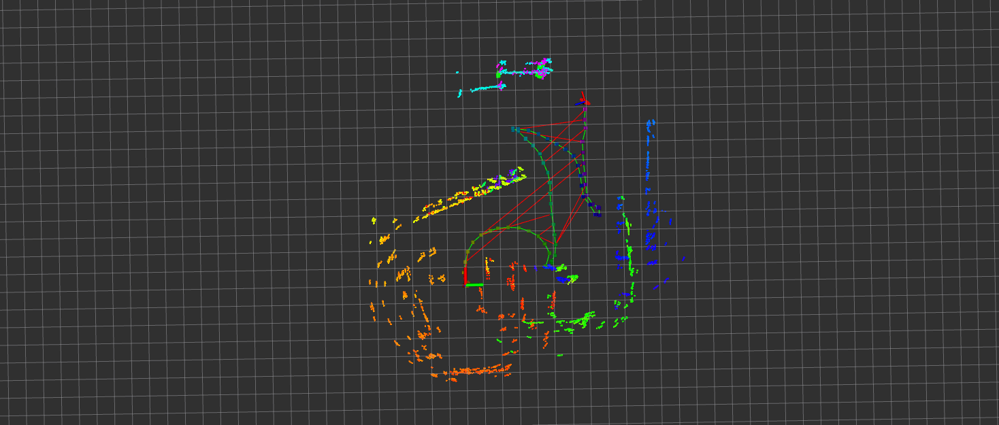
---

## Test 1 — Pfa réduit (0.01)

| Paramètre | Valeur baseline | Valeur testée |
|-----------|----------------|---------------|
| Pfa | 0.1 | 0.01 |

**Observation :**
- Moins de points détectés (nuage orange moins dense)
- Trajectoire globale identique
- Légères différences locales → ICP a moins de correspondances
- Loop closures inchangés globalement

**Conclusion :** Pfa impacte la précision locale mais iSAM2 + loop closure corrigent globalement.

---

## Test 2 — Pfa très réduit (0.001)

| Paramètre | Valeur baseline | Valeur testée |
|-----------|----------------|---------------|
| Pfa | 0.1 | 0.01 |

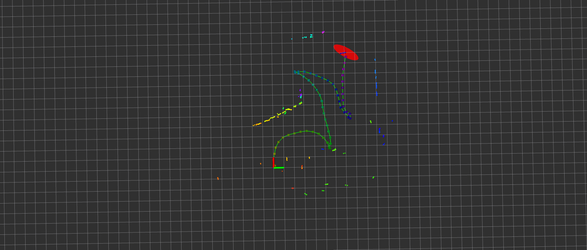

**Observation :**
- Beaucoup moins de points détectés
- Trajectoire globale inchangée malgré la très faible densité
- Loop closures toujours présents

**Conclusion :** Même avec très peu de points, ICP + iSAM2 maintiennent une trajectoire cohérente. Le système est robuste à la réduction de features.

---

## Test 3 — Threshold bas (30)

| Paramètre | Valeur baseline | Valeur testée |
|-----------|----------------|---------------|
| threshold | 65 | 30 |

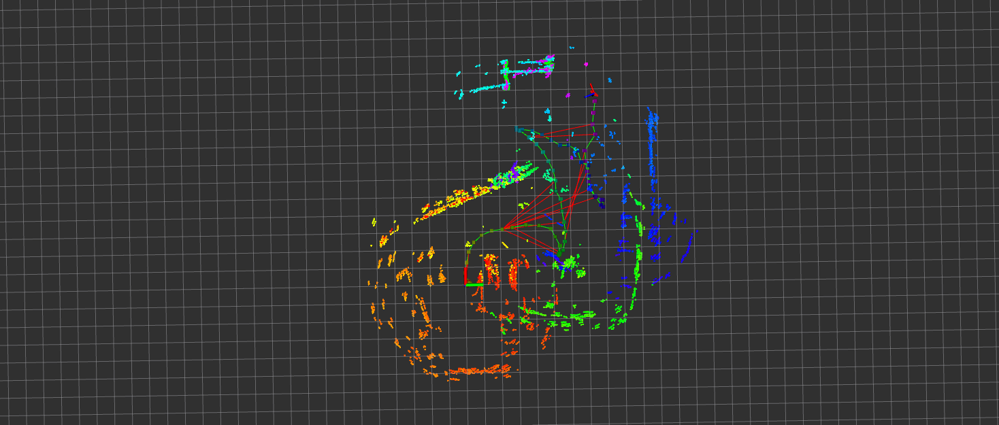

**Observation :**
- Beaucoup de points (nuage dense, bleu/vert/orange/jaune) → beaucoup de faux positifs acceptés
- Moins de loop closures que la baseline
- Début de drift visible, zigzags sur la trajectoire

**Conclusion :** Un threshold trop bas inonde ICP de faux positifs → recalage bruité → drift local. Paradoxalement moins de loop closures car les scans bruités se ressemblent moins.

---

## Test 4 — Threshold élevé (90)

| Paramètre | Valeur baseline | Valeur testée |
|-----------|----------------|---------------|
| threshold | 65 | 90 |

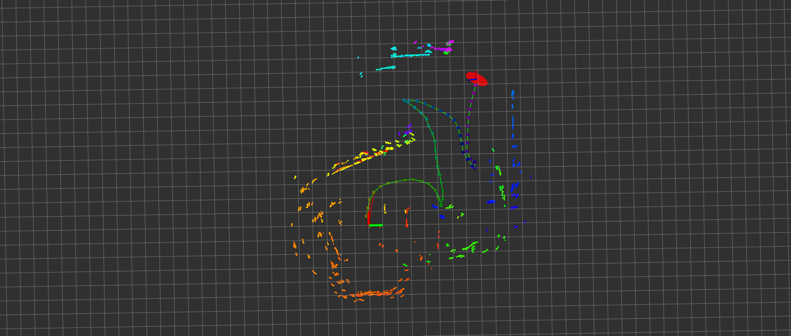

**Observation :**
- Moins de points détectés
- Moins de loop closures
- Trajectoire propre, similaire à la baseline

**Conclusion :** threshold (filtre absolu) a plus d'impact que Pfa (filtre relatif). À 90, on garde seulement les réflexions fortes → ICP propre → bonne trajectoire mais moins de loop closures.

---

## Test 5 — Resolution fine (0.1)

| Paramètre | Valeur baseline | Valeur testée |
|-----------|----------------|---------------|
| resolution | 0.5 | 0.1 |

**Définition :** Plus la valeur est basse, plus le nuage de points est dense (voxels plus petits).

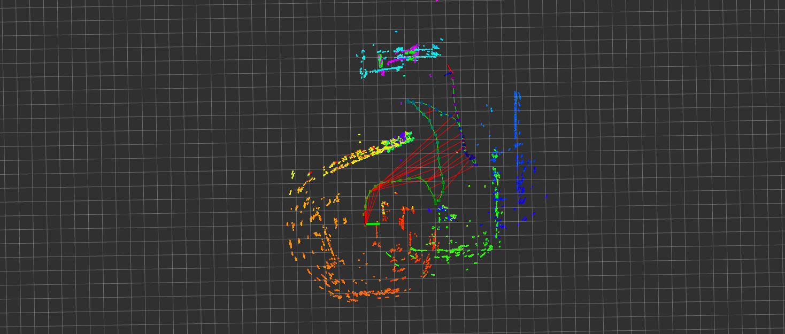

**Observation :**
- Beaucoup plus de points dans le nuage
- Trajectoire plus géométrique (angles nets, formes précises)
- Beaucoup de loop closures, y compris entre le début et la fin du parcours

**Conclusion :** Plus de points → ICP plus précis → meilleure géométrie et plus de loop closures. Coût : temps de calcul plus élevé.

---

## Test 6 — Resolution grossière (2.0)

| Paramètre | Valeur baseline | Valeur testée |
|-----------|----------------|---------------|
| resolution | 0.5 | 2.0 |

**Définition :** Plus la valeur est haute, moins il y a de points conservés (voxels plus grands).

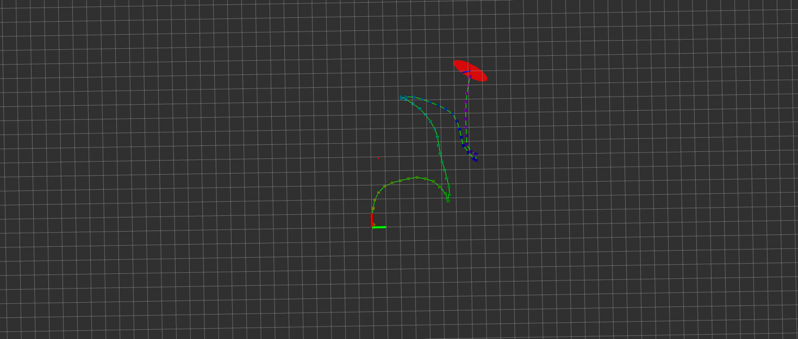

**Observation :**
- Presque aucun point dans le nuage
- Trajectoire pourtant cohérente
- Loop closures uniquement au tout début du parcours

**Conclusion :** ICP fonctionne encore avec très peu de points grâce au dead reckoning (DVL/IMU), mais perd la capacité de détecter des loop closures tardifs.

---

## Test 7 — Radius bas (0.3)

| Paramètre | Valeur baseline | Valeur testée |
|-----------|----------------|---------------|
| radius | 1.0 | 0.3 |

**Définition :** radius = rayon de recherche pour l'outlier rejection. Un point est supprimé s'il n'a pas assez de voisins dans ce rayon. Valeur basse → zone de recherche réduite → plus de points supprimés.

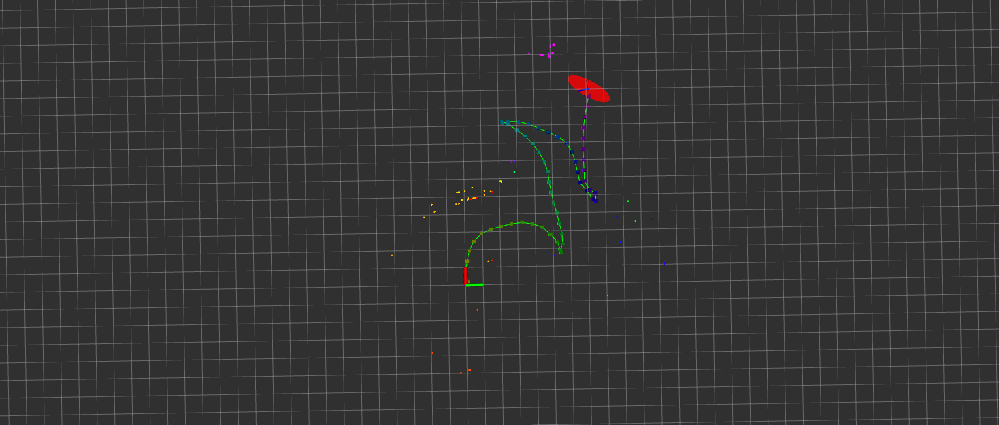

**Observation :**
- Peu de points (beaucoup supprimés car zone trop petite)
- Trajectoire décalée par rapport à la baseline
- Pas de loop closure

**Conclusion :** Trop peu de points → ICP perd en précision → drift. Sans loop closure, pas de correction globale.

---

## Test 8 — Radius élevé (3.0)

| Paramètre | Valeur baseline | Valeur testée |
|-----------|----------------|---------------|
| radius | 1.0 | 3.0 |

**Définition :** Valeur haute → zone de recherche large → points isolés conservés, moins de suppression.

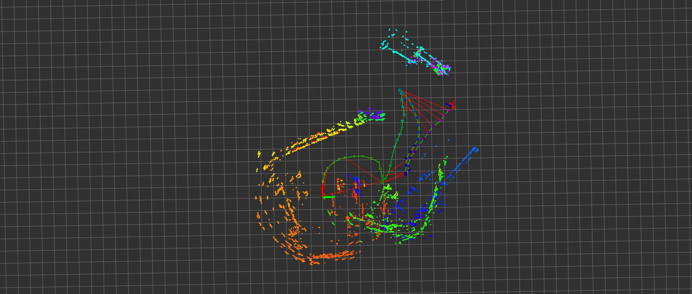

**Observation :**
- Nombre de points normal
- Trajectoire décalée par rapport à la baseline
- Loop closure visibles et actifs (correction visible en temps réel)
- Nombre de loop closures normal

**Conclusion :** Avec un radius trop grand, des faux points (outliers) sont conservés → ICP bruité → trajectoire décalée. Les loop closures compensent partiellement mais ne suffisent pas à corriger complètement.

---

## Test 9 — ICP maxDist outlier bas (1.0)

| Paramètre | Fichier | Valeur baseline | Valeur testée |
|-----------|---------|----------------|---------------|
| MaxDistOutlierFilter maxDist | icp.yaml | 3.0 | 1.0 |

**Définition :** distance max acceptée entre deux points associés par ICP. Au-delà → paire rejetée comme outlier.

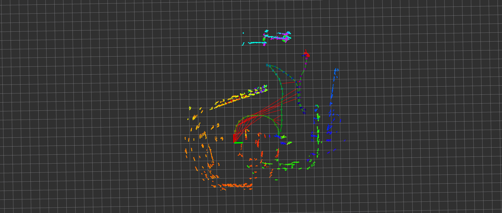

**Observation :**
- Nombre de points similaire à la baseline
- Plus de loop closures détectés
- Trajectoire similaire à la baseline

**Conclusion :** Seuil plus strict → ICP garde seulement les correspondances très proches → recalage plus précis → meilleure détection de loop closures.

---

## Test 10 — ICP maxDist outlier élevé (6.0)

| Paramètre | Fichier | Valeur baseline | Valeur testée |
|-----------|---------|----------------|---------------|
| MaxDistOutlierFilter maxDist | icp.yaml | 3.0 | 6.0 |

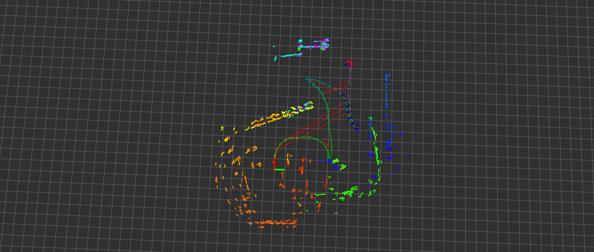

**Observation :**
- Nombre de points similaire à la baseline
- Trajectoire similaire à la baseline
- Résultat global peu différent de la baseline

**Conclusion :** À 6m le filtre est permissif mais ICP converge quand même grâce au TrimmedDist qui filtre les 20% pires correspondances.

---

## Test 11 — ICP ratio TrimmedDist bas (0.5)

| Paramètre | Fichier | Valeur baseline | Valeur testée |
|-----------|---------|----------------|---------------|
| TrimmedDistOutlierFilter ratio | icp.yaml | 0.8 | 0.5 |

**Définition :** garde seulement les X% meilleures correspondances ICP. 0.5 = garde 50%.

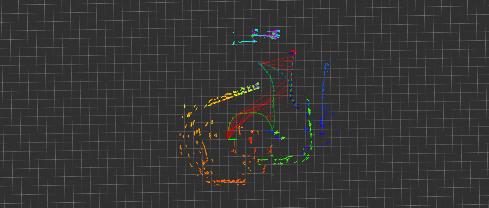

**Observation :** Peu de différences par rapport à la baseline.

**Conclusion :** ICP est robuste à ce paramètre — les 50% meilleures correspondances suffisent à converger correctement.

---

## Test 12 — ICP ratio TrimmedDist élevé (0.95)

| Paramètre | Fichier | Valeur baseline | Valeur testée |
|-----------|---------|----------------|---------------|
| TrimmedDistOutlierFilter ratio | icp.yaml | 0.8 | 0.95 |

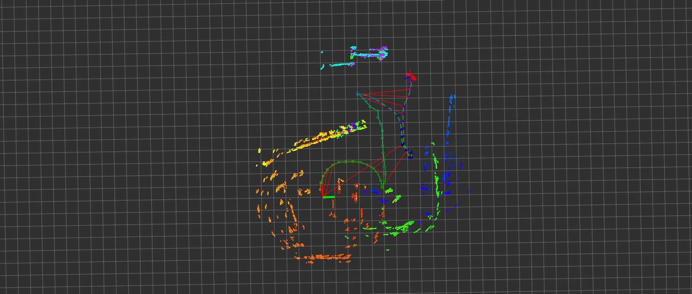

**Observation :** Peu de différences par rapport à la baseline.

**Conclusion :** Garder 95% des correspondances n'introduit pas assez de bruit supplémentaire pour dégrader ICP — MaxDistOutlierFilter filtre déjà les pires cas en amont.

---

## À tester

- [ ] Paramètres loop closure / iSAM2 (`slam.yaml`)

---

## Dataset Aracati2017 — Test SSM + NSSM paramètres défaut (27 mai 2026)

### Paramètres actifs

| Fichier | Paramètre | Valeur |
|---------|-----------|--------|
| `feature_aracati.yaml` | threshold | 30 |
| `feature_aracati.yaml` | resolution | 0.5 |
| `feature_aracati.yaml` | skip | 5 |
| `feature_aracati.yaml` | Pfa | 0.1 |
| `feature_aracati.yaml` | cartesian_mode | True (BlueView P900-130) |
| `slam_aracati.yaml` | SSM enable | **True** |
| `slam_aracati.yaml` | SSM max_translation | 3.0 m |
| `slam_aracati.yaml` | SSM max_rotation | 30° |
| `slam_aracati.yaml` | NSSM enable | **True** |
| `slam_aracati.yaml` | NSSM max_translation | 10.0 m |
| `slam_aracati.yaml` | NSSM max_rotation | 60° |
| `icp.yaml` | errorMinimizer | PointToPointErrorMinimizer |
| `icp.yaml` | MaxDistOutlierFilter maxDist | 3.0 |
| `icp.yaml` | TrimmedDistOutlierFilter ratio | 0.8 |

### Résultats

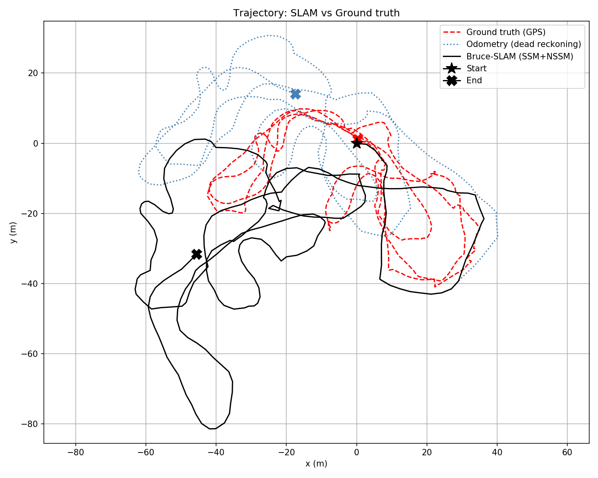

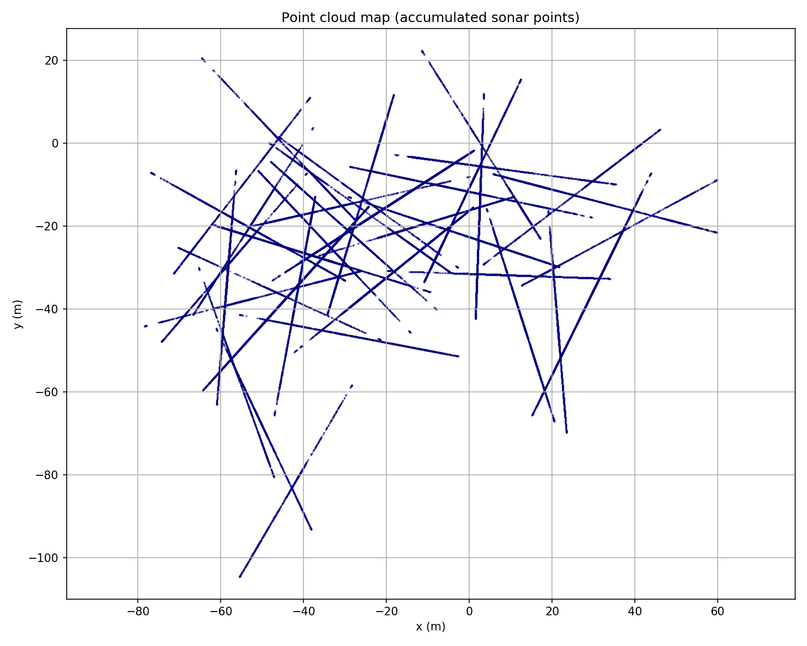

### Observations

- **Odométrie (bleu pointillé)** : bonne forme générale, proche du GT, drift attendu
- **Trajectoire SLAM (noir)** : dérive largement, forme incohérente avec GT et odométrie
- **Carte point cloud** : lignes droites visibles dans chaque scan ✅ mais orientées dans toutes les directions → ICP ne recale pas les scans entre eux
- SSM introduit des erreurs au lieu de les corriger
- NSSM produit de faux loop closures (warning sklearn "covariance not full rank")

### Conclusion

**ICP (SSM+NSSM) dégrade la trajectoire par rapport à l'odométrie seule** sur Aracati2017. Causes :
- Image sonar BlueView basse résolution + bruit élevé → mauvaise extraction de points
- ICP sensible aux conditions initiales → converge vers minimum local
- Sans DVL/IMU (odométrie depuis `/cmd_vel`), l'initialisation ICP est moins précise

**Confirmé par le papier DISO (Xu et al., ICRA 2024)** : BlueROV SLAM (= ICP) donne 16.25% d'erreur de translation sur Aracati2017 vs 8.69% pour DISO. La méthode directe par intensité sonar est nécessaire pour ce dataset.

---

## Indications doctorante — Aracati2017 (25 mai 2026)

Objectif : la trajectoire Bruce-SLAM doit se situer **entre odométrie et GT** (pas identique à l'odo, pas aussi bonne que le GT).

Problème actuel : avec SSM+NSSM activés, la trajectoire Bruce-SLAM a une forme complètement différente de GT et odométrie → quelque chose ne va pas.

### Plan de débogage (dans l'ordre)

- [ ] **1. Désactiver NSSM, garder SSM uniquement** — déboguer SSM seul d'abord
- [ ] **2. Ajuster le seuil de sélection SSM vs odométrie** — Bruce-SLAM choisit entre facteur odométrie et facteur SSM selon la qualité de l'ICP ; essayer d'ajuster ce seuil
- [ ] **3. Ajuster les paramètres CFAR/débruitage** (`feature_aracati.yaml`) — la conversion image sonar → points peut introduire du bruit
- [ ] **4. Exporter la carte point cloud** (points cumulés comme dans RViz, hors trajectoire) dans `results/pointcloud_map.csv` et générer une image 2D
  - La carte doit montrer des **lignes droites** (murs du port) et non des arcs
  - Si la carte montre des arcs → problème dans la conversion pixels→mètres de l'image BlueView
- [ ] **5. Une fois SSM OK, réactiver NSSM**

---

## Dataset Aracati2017 — Tests d'intégration

Dataset : BlueView P900-130, FOV 130°, max range 50m, marina Yacht Club Rio Grande (Brésil).
Différence principale vs sample_data : odométrie par intégration de `/cmd_vel` (pas de DVL/IMU) → plus grande erreur de dead reckoning.

### Modifications apportées à bruce_slam

- `feature_extraction.py` : ajout du mode `cartesian_mode=True` pour accepter les images PNG cartésiennes du BlueView directement (sans `OculusPing`)
- `odom_bridge.py` : nœud de conversion `/odom_pose` (PoseStamped) → `nav_msgs/Odometry` sur `/bruce/slam/localization/odom`
- `launch/aracati.launch` : launch file combinant aracati2017 + bruce_slam
- `config/feature_aracati.yaml` : paramètres feature extraction pour le BlueView (threshold=65, cartesian_mode=True, FOV=130°, max_range=50m)
- `config/slam_aracati.yaml` : paramètres SLAM adaptés (odom_sigmas augmentés, min_pcm=4)

### Test 1 — Odométrie pure (SSM=False, NSSM=False)

**Observation :** Trajectoire cohérente, forme similaire au ground truth GPS (vert). Drift visible mais attendu (odométrie seule sans correction sonar).

**Conclusion :** Le bridge odométrie fonctionne correctement. La forme globale est cohérente avec la réalité.

### Test 2 — SSM activé (NSSM=False)

**Observation :** Trajectoire dégradée — SSM introduit des erreurs. ICP ne converge pas correctement sur ce dataset.

**Conclusion :** Les paramètres ICP calibrés pour l'Oculus M750d ne sont pas adaptés au BlueView P900-130. Le recalage local échoue et dégrade la trajectoire.

### Test 3 — SSM + NSSM activés

**Observation :** Faux loop closures nombreux (traits rouges partant tous vers le début). Trajectoire incohérente avec le ground truth.

**Conclusion :** NSSM détecte de fausses correspondances — les scans BlueView sont trop différents des scans Oculus pour que le NSSM fonctionne avec ces paramètres. `min_pcm=4` ne suffit pas à rejeter les faux positifs.

### Conclusion générale

Bruce-SLAM intégré avec Aracati2017 fonctionne en mode odométrie pure. SSM et NSSM nécessitent un recalibrage des paramètres ICP spécifique au sonar BlueView P900-130 pour fonctionner correctement sur ce dataset.

---

## Dataset Aracati2017 — DISO Standalone (2026-06-03)

Front-end DISO uniquement (pas de back-end iSAM2). Odométrie directe par intensité sonar (pas ICP).

### Configuration

| Composant | Valeur |
|-----------|--------|
| Nœud | `direct_sonar_odometry/aracati2017_node` |
| Config | `config/config_aracati2017.yaml` |
| Back-end | aucun (pas de loop closure, pas de iSAM2) |
| Topic pose | `/direct_sonar/pose` |

### Résultats

**Trajectoire DISO vs GT :**
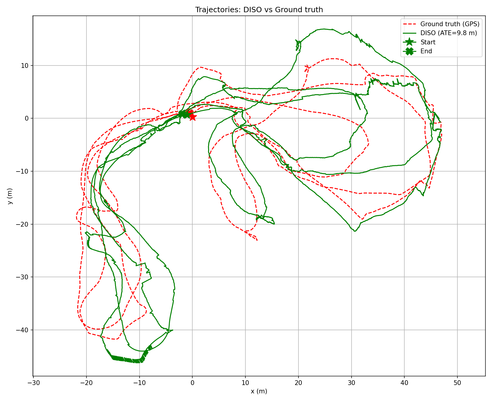

**Carte point cloud DISO :**
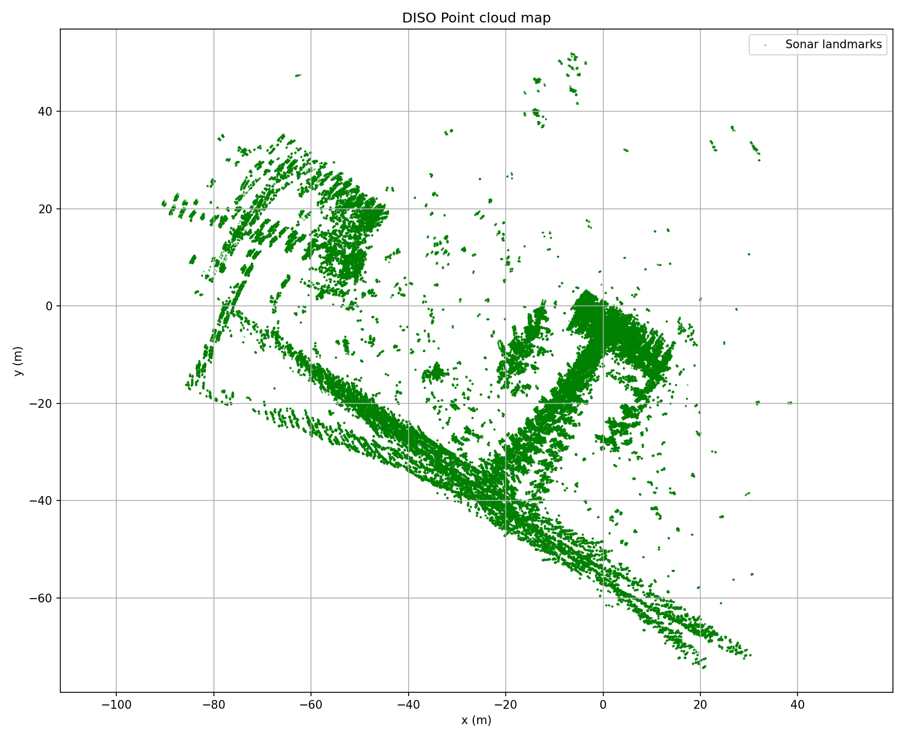

### Observations

- Trajectoire DISO suit la forme générale du GT (GPS)
- Dérive progressive visible (pas de loop closure pour corriger)
- Point cloud cohérent — les structures du port sont reconnaissables

### ATE

**ATE = 6.5 m**

---

## Dataset Aracati2017 — DISO + Bruce_SLAM (iSAM2, SSM=off, NSSM=off) (2026-06-03)

DISO comme source d'odométrie sonar, back-end iSAM2 de Bruce_SLAM. SSM (ICP) désactivé car DISO le remplace. NSSM désactivé (faux loop closures).

### Configuration

| Composant | Valeur |
|-----------|--------|
| Front-end odométrie | DISO (`/direct_sonar/pose` → `odom_bridge` → `/bruce/slam/localization/odom`) |
| SSM | **False** (DISO remplace ICP) |
| NSSM | **False** (faux loop closures sur Aracati) |
| Back-end | iSAM2 |
| Covariance odom_bridge | 0.1 (position), 0.05 (rotation) |

### Résultats

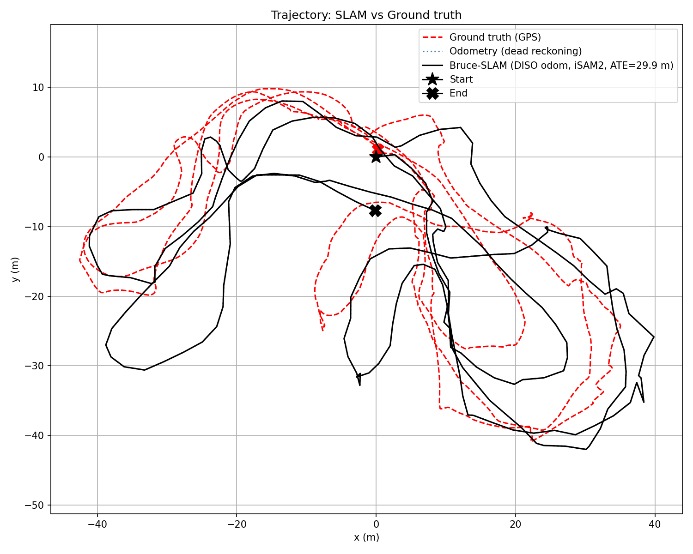

### Observations

- Sans loop closure, iSAM2 propage les poses DISO sans correction globale
- Résultat légèrement moins bon que DISO standalone (latence bridge + overhead iSAM2 sans boucle)
- Le gain réel de Bruce_SLAM viendra quand NSSM sera réactivé avec Sonar Context

### ATE

**ATE = 29.9 m**

### Conclusion

**Sans NSSM, DISO+Bruce_SLAM est nettement pire que DISO standalone (29.9 m vs 6.5 m).** iSAM2 sans loop closure ne fait que propager les erreurs avec overhead supplémentaire (latence bridge, désynchronisation temporelle possible). Le gain réel de Bruce_SLAM viendra quand NSSM sera réactivé avec Sonar Context pour corriger la dérive globale.

> ⚠️ Note rétrospective : les ATE 29.9 m / 6.5 m de cette section ont été calculés avec
> l'ancienne méthode d'alignement (flip Y manuel + association `linspace`), peu fiable.
> Voir la section suivante pour la méthode d'évaluation robuste (Umeyama + interpolation
> temporelle) et des valeurs correctes.

---

## Méthode d'évaluation ATE — passage à Umeyama (2026-06-04)

L'ancien alignement (flip Y hardcodé + rotation par centroïde + association des points par
`np.linspace`) était fragile : un simple décalage en X faussait l'ATE, et le flip Y devait
être géré à la main.

**Nouvelle méthode (standard TUM/evo)** implémentée dans `traj_eval.py` :
1. **Association temporelle** par interpolation sur la colonne `time` → compare chaque pose
   estimée à la pose GT au même instant (résout les tailles différentes : DISO ~14k poses,
   Bruce ~600 keyframes, GT ~14k).
2. **Alignement rigide Umeyama** (SVD) → trouve rotation + translation optimales et **absorbe
   automatiquement la réflexion Y** (det R = -1) → plus aucun flip manuel.
3. **Sans échelle** (s=1) → ATE métrique honnête en mètres.

Fait confirmé : `corr(diso_y, gt_y) = -0.95` → l'axe Y de DISO est l'opposé du GT (réflexion
physique du repère, pas un bug). Umeyama la gère seul.

`analyze_diso.py` et `analyze_drift.py` utilisent désormais ce module partagé.

---

## Run DISO + Bruce_SLAM — config affinée, ATE Umeyama (2026-06-04)

Run propre (aucun saut/trou temporel, contrairement aux runs précédents avec paramètres
NSSM trop conservateurs). Archivé dans `TESTS_image/run_diso_bruce_2026-06-04_ate5.4/`
(CSV + PNG).

### Configuration complète

| Fichier | Paramètre | Valeur |
|---------|-----------|--------|
| `slam_aracati.yaml` | keyframe_duration | 1.0 s |
| `slam_aracati.yaml` | **keyframe_translation** | **1.0 m** (était 3.0 → plus de keyframes) |
| `slam_aracati.yaml` | keyframe_rotation | deg(30) |
| `slam_aracati.yaml` | prior_sigmas | [0.1, 0.1, 0.01] |
| `slam_aracati.yaml` | odom_sigmas | [0.5, 0.5, 0.05] |
| `slam_aracati.yaml` | icp_odom_sigmas | [0.1, 0.1, 0.01] |
| `slam_aracati.yaml` | point_resolution | 0.5 |
| `slam_aracati.yaml` | **ssm enable** | **False** (DISO remplace ICP) |
| `slam_aracati.yaml` | **nssm enable** | **False** |
| `slam_aracati.yaml` | min_pcm | 4 |
| `slam_aracati.yaml` | pz_detection_rate | 0.3 |
| `feature_aracati.yaml` | CFAR Pfa | 0.1 |
| `feature_aracati.yaml` | CFAR alg | SOCA (Ntc=40, Ngc=10, rank=10) |
| `feature_aracati.yaml` | threshold | 30 |
| `feature_aracati.yaml` | resolution | 0.5 |
| `feature_aracati.yaml` | radius / min_points | 1.0 / 5 |
| `feature_aracati.yaml` | skip | 5 |
| `feature_aracati.yaml` | cartesian_mode | True (FOV 130°, max_range 50 m) |
| `odom_bridge.py` | covariance | 0.1 (position), 0.05 (rotation) |
| `config_aracati2017.yaml` (DISO) | Tbs | identité |
| `config_aracati2017.yaml` (DISO) | OdomTopic / SonarTopic | /pose_gt / /son |

### Résultats

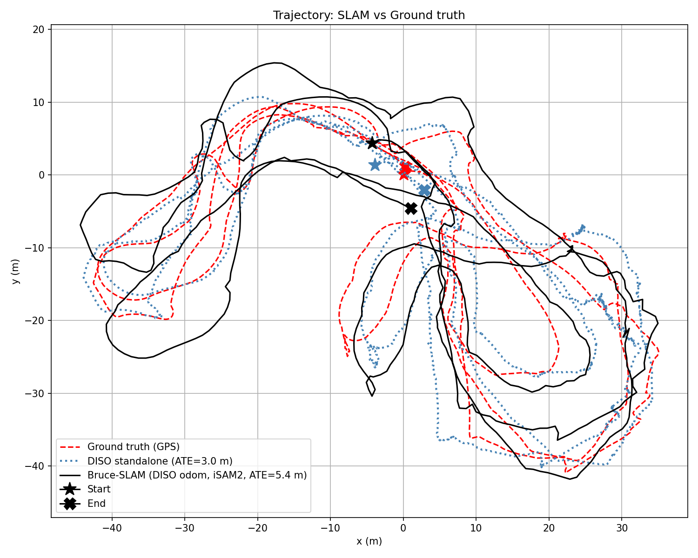

| Trajectoire | ATE (Umeyama, sans échelle) | N points |
|-------------|-----------------------------|----------|
| DISO standalone | **3.0 m** | ~14 400 |
| DISO + Bruce_SLAM (iSAM2, sans loop closure) | **5.4 m** | 619 keyframes |

### Observations

- Run propre : 619 keyframes, dt max 23 s, **aucun trou temporel** (les sauts des runs
  précédents venaient des paramètres NSSM conservateurs, maintenant remis à la config de base).
- Bruce suit visuellement bien la forme du GT.
- DISO standalone (3.0 m) reste meilleur que DISO+Bruce (5.4 m) car sans loop closure
  iSAM2 ne corrige pas — il propage les poses DISO avec l'overhead du bridge.

### Conclusion

Le pipeline tourne proprement et l'évaluation est maintenant fiable (Umeyama). Tant que NSSM
est désactivé, Bruce_SLAM n'apporte pas de gain sur DISO. Prochaine étape : intégrer Sonar
Context dans le NSSM pour activer le loop closure et faire descendre l'ATE Bruce sous celui
de DISO.

---

## Run DISO + Bruce_SLAM — NSSM ON (2026-06-04)

Test avec le loop closure NSSM réactivé. Archivé dans
`TESTS_image/run_diso_bruce_2026-06-04_nssm_on_ate6.2/`.

### Configuration (différences vs run NSSM off précédent)

| Fichier | Paramètre | Valeur |
|---------|-----------|--------|
| `slam_aracati.yaml` | **nssm enable** | **True** |
| `slam_aracati.yaml` | nssm min_st_sep | 8 |
| `slam_aracati.yaml` | nssm min_points | 100 |
| `slam_aracati.yaml` | nssm max_translation | 5.0 m |
| `slam_aracati.yaml` | nssm max_rotation | deg(30) |
| `slam_aracati.yaml` | nssm source_frames | 5 |
| `slam_aracati.yaml` | min_pcm | 6 |
| (ssm reste off, reste identique au run NSSM off) | | |

### Résultats

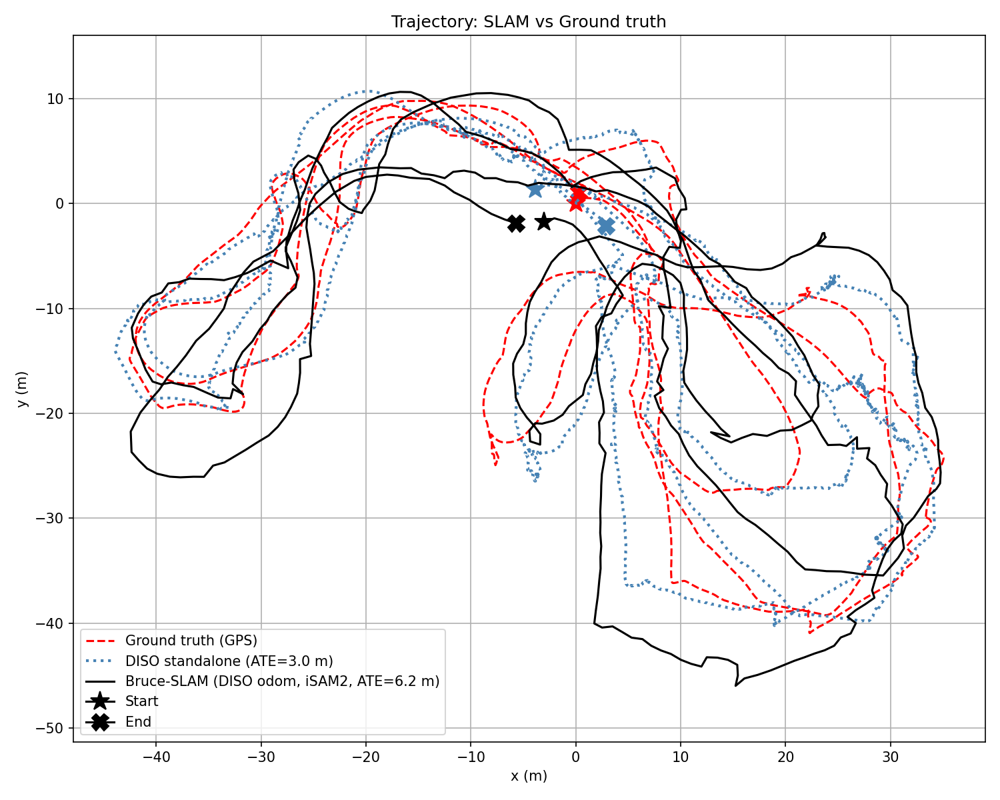

| Run | ATE Bruce | Loop closures (nssm_constraints) | N keyframes | Trous > 30s |
|-----|-----------|----------------------------------|-------------|-------------|
| NSSM **off** | 5.4 m | 0 | 619 | 0 |
| NSSM **on** | **6.2 m** | **0** | 569 | 2 |
| DISO standalone | 3.0 m | — | — | — |

### Observations

- **NSSM n'a détecté AUCUN loop closure** (0 constraints) malgré son activation.
- L'ATE est légèrement pire (6.2 m vs 5.4 m), pas meilleur. Causes probables :
  - 2 trous temporels (dt max 32.9 s) dans ce run alors que le run NSSM off n'en avait aucun.
  - Overhead du NSSM (recherche de candidats + ICP de vérification) sans aucun bénéfice
    puisque 0 boucle trouvée.
  - Variance run-to-run (timing temps réel différent).

### Conclusion

**Le NSSM natif de Bruce_SLAM est inopérant sur Aracati2017** : sa détection de boucle
(features + ICP) ne trouve aucune correspondance sur les scans BlueView, donc 0 correction
et seulement de l'overhead. C'est exactement le problème que **Sonar Context** (ICRA 2023)
résout — détection de lieu robuste sans ICP, testée sur Aracati2017. Confirme la pertinence
de l'intégrer dans le NSSM.

---

## Run DISO + Bruce_SLAM — NSSM ON, params relâchés (2026-06-04)

Re-run NSSM on avec des seuils **plus permissifs** que le run précédent, pour tenter de
déclencher des loop closures. Commit : `Run NSSM on, min_points 100 max_translation 8,
max_rotation 45, min_pcm 4`. Archivé dans
`TESTS_image/run_diso_bruce_2026-06-04_nssm_on_ate5.5/`.

### Configuration

| Fichier | Paramètre | Run précédent (6.2 m) | Ce run (5.5 m) |
|---------|-----------|-----------------------|----------------|
| `slam_aracati.yaml` | nssm min_points | 100 | 100 |
| `slam_aracati.yaml` | nssm max_translation | 5.0 m | **8.0 m** |
| `slam_aracati.yaml` | nssm max_rotation | deg(30) | **deg(45)** |
| `slam_aracati.yaml` | min_pcm | 6 | **4** |

Seuils relâchés (zone de recherche plus large, moins de votes PCM requis) = conditions
plus favorables à la détection de boucle.

### Résultats

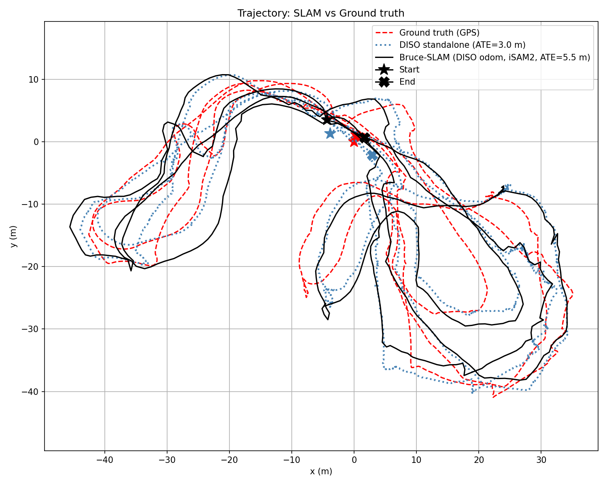

| Run NSSM on | max_trans / max_rot / min_pcm | ATE Bruce | Loop closures | N kf | Trous > 30s |
|-------------|-------------------------------|-----------|---------------|------|-------------|
| #1 (strict) | 5.0 / 30° / 6 | 6.2 m | 0 | 569 | 2 |
| #2 (relâché) | 8.0 / 45° / 4 | **5.5 m** | **0** | 579 | 1 |

### Observations

- **Même en relâchant les seuils, 0 loop closure** détecté → NSSM natif confirmé inopérant
  quels que soient les paramètres testés.
- ATE 5.5 m (relâché) vs 6.2 m (strict) : la légère amélioration vient surtout du nombre de
  trous (1 vs 2), pas du NSSM (toujours 0 boucle).
- Reste au-dessus de DISO standalone (3.0 m).

### Conclusion

Le NSSM natif ne trouve **aucune boucle sur Aracati2017, ni avec des seuils stricts ni
relâchés**. Le problème n'est pas le réglage mais la méthode de détection elle-même
(features + ICP, inadaptée au sonar BlueView). C'est exactement ce que **Sonar Context**
(ICRA 2023) corrige.

> ⚠️ **Correction (voir run suivant)** : cette conclusion était ERRONÉE. Le vrai problème
> n'était pas la méthode NSSM mais le paramètre `skip: 5` qui rendait 69 % des keyframes
> vides (pas de features → rien à matcher). Avec `skip: 1`, le NSSM trouve bien des boucles.

---

## Run DISO + Bruce_SLAM — skip=1, NSSM trouve des boucles ! (2026-06-05)

**Découverte majeure.** Le paramètre `skip: 5` de `feature_aracati.yaml` ne traitait qu'1 scan
sonar sur 5 → 69 % des keyframes étaient vides → le NSSM n'avait aucune feature à matcher → 0
boucle. En passant à **`skip: 1`**, tous les scans sont traités, les keyframes ne sont plus
vides, et le NSSM **détecte enfin des loop closures**.

### Configuration

| Fichier | Paramètre | Valeur |
|---------|-----------|--------|
| `feature_aracati.yaml` | **skip** | **1** (était 5) |
| `feature_aracati.yaml` | threshold | 30 |
| `slam_aracati.yaml` | ssm enable | False |
| `slam_aracati.yaml` | nssm enable | True |
| `slam_aracati.yaml` | nssm min_points | 30 |
| `slam_aracati.yaml` | nssm max_translation | 8.0 m |
| `slam_aracati.yaml` | nssm max_rotation | deg(45) |
| `slam_aracati.yaml` | nssm source_frames | 5 |

### Résultats

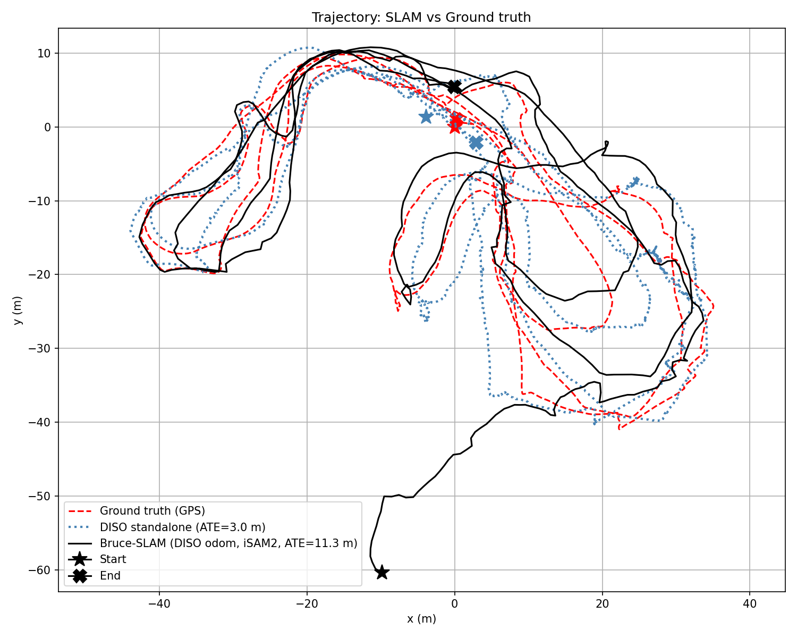

| Métrique | Runs précédents (skip=5) | Ce run (skip=1) |
|----------|--------------------------|-----------------|
| Keyframes vides | 69 % | **0 %** |
| **Loop closures NSSM** | **0** | **8** |
| N keyframes | ~570 | 551 |
| ATE Bruce | 5.4–6.2 m | 11.3 m |
| ATE DISO standalone | 3.0 m | 3.0 m |

### Observations

- **Le NSSM fonctionne** : 8 loop closures détectées (vs 0 avant). Le diagnostic « features+ICP
  inadaptés » était faux — il manquait juste des features (cause : `skip: 5`).
- **Comportement de la trajectoire** (qualitatif) :
  - **Départ erroné** : très mauvaise initialisation (Bruce part vers y ≈ -60, loin du GT).
  - **Milieu** : se recalibre progressivement grâce aux loop closures détectées.
  - **Fin** : trajectoire bien alignée sur le GT.
- L'**ATE global (11.3 m) est élevé à cause du mauvais départ**, pas du loop closure (qui
  améliore au contraire la fin). Le RMSE est dominé par l'erreur d'initialisation.
- 2 trous temporels subsistent (dt max 34.8 s).

### Conclusion

`skip: 1` débloque le NSSM natif (0 → 8 boucles). Le loop closure recale bien la trajectoire en
cours de route. **Deux problèmes restants** : (1) la mauvaise initialisation de départ qui plombe
l'ATE, (2) seulement 8 boucles, dont l'effet reste limité. C'est là que **Sonar Context**
apportera plus : une détection de boucle plus dense et robuste → recalage plus précoce et plus
fort. Prochaine étape : investiguer l'init de départ, puis tester d'autres seuils NSSM
maintenant que les features sont disponibles.

### Analyse approfondie du run skip=1 (les 8 boucles sont FAUSSES)

En analysant la forme de la trajectoire (corrélation avec le GT) :

| Trajectoire | corr_x | corr_y | Forme |
|-------------|--------|--------|-------|
| DISO standalone | +0.99 | -0.99 | excellente |
| Bruce `dr_` (DISO via bridge, AVANT NSSM) | +0.99 | **-0.88** | bonne |
| Bruce `x/y` (APRÈS les 8 boucles NSSM) | -0.80 | **-0.12** | **cassée** |

→ Le NSSM **dégrade** la trajectoire : avant correction la forme est bonne (-0.88), après les 8
boucles elle est cassée (-0.12). Les 8 loop closures (toutes groupées kf 49-65) sont donc
**fausses / mal contraintes** : elles tordent la trajectoire au lieu de la corriger. Le
« départ à y=-60 » du plot est un artefact d'alignement Umeyama causé par cette déformation
globale, pas une vraie erreur d'initialisation du SLAM (kf0 brut = (0,0) = correct).

---

## Run DISO + Bruce_SLAM — skip=1, min_pcm=6 : fausses boucles filtrées (2026-06-05)

Suite du diagnostic : les 8 boucles du run précédent étant fausses, on durcit le filtre PCM
(Pairwise Consistency Maximization) de `min_pcm: 4` à **`min_pcm: 6`** pour les rejeter.

### Configuration

| Fichier | Paramètre | Valeur |
|---------|-----------|--------|
| `feature_aracati.yaml` | skip | 1 |
| `slam_aracati.yaml` | nssm enable | True |
| `slam_aracati.yaml` | nssm min_points | 30 |
| `slam_aracati.yaml` | nssm max_translation | 8.0 m |
| `slam_aracati.yaml` | nssm max_rotation | deg(45) |
| `slam_aracati.yaml` | **min_pcm** | **6** (était 4) |

### Résultats

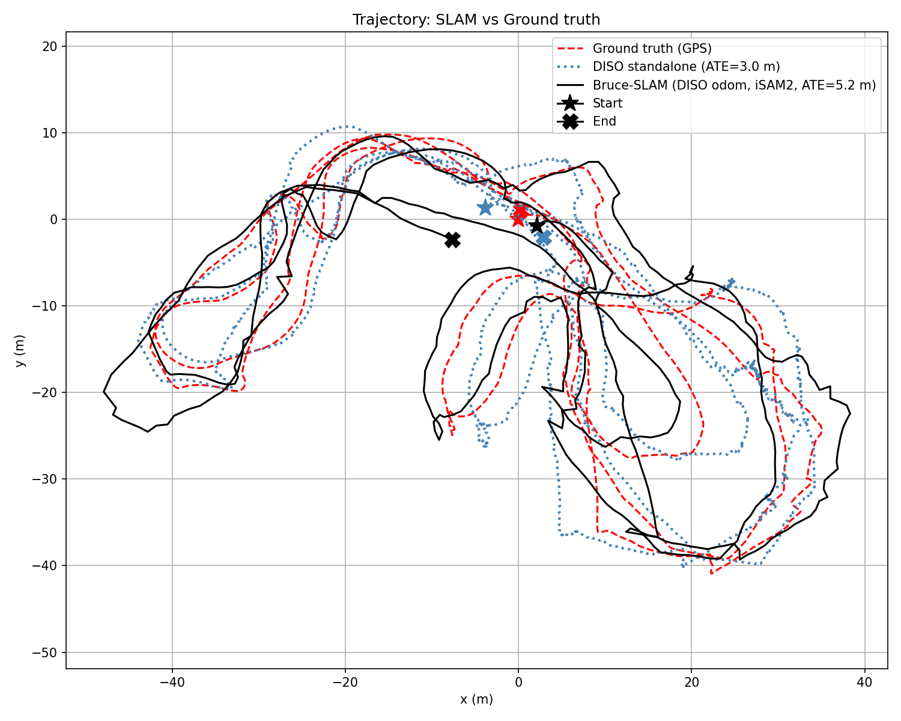

| Métrique | min_pcm=4 | **min_pcm=6** |
|----------|-----------|---------------|
| Loop closures | 8 (fausses) | **0** |
| corr_y avant NSSM | -0.88 | -0.98 |
| corr_y après NSSM | -0.12 (cassée) | **-0.98 (préservée)** |
| ATE Bruce | 11.3 m | **5.2 m** |
| Trous > 30 s | 2 | **0** |

### Observations

- `min_pcm: 6` **rejette les 8 fausses boucles** → la forme de la trajectoire est préservée
  (corr_y reste -0.98) → ATE divisé par ~2 (11.3 → 5.2 m). Run parfaitement propre (0 trou).
- Conséquence : retour à **0 loop closure**. Le PCM filtre TOUT car les 8 boucles étaient
  toutes fausses ; il n'y a aucune vraie boucle à valider.

### Conclusion

Le NSSM natif sur Aracati2017 ne propose que des **fausses boucles** : soit on les garde
(min_pcm 4 → trajectoire cassée, ATE 11.3 m), soit on les filtre (min_pcm 6 → 0 boucle, ATE
5.2 m mais aucun gain de loop closure). Dans les deux cas, **aucun bénéfice réel du loop
closure**. C'est l'argument définitif pour **Sonar Context** : une détection de lieu qui
propose de *vraies* boucles robustes, validables par le PCM. Le meilleur réglage actuel
(min_pcm 6, ATE 5.2 m) sert de **baseline** à battre avec Sonar Context.

---

## Branche Bruce_Sonar_USBL — Run 1 : USBL facteurs seuls (loops OFF) (2026-06-17)

Branche dédiée à la fusion USBL par facteurs dans le graphe gtsam. Odométrie cmd_vel,
SSM off, loops (nssm + sonar_context) off — on valide les facteurs USBL **isolément**.
Archivé dans `TESTS_image/run_aracati_Bruce_Sonar_USBL_2026-06-17_215206/`.

### Configuration

| Paramètre | Valeur |
|---|---|
| Odométrie | cmd_vel (intégration /cmd_vel, seed GT à t=0 uniquement) |
| SSM | False |
| NSSM | False |
| Sonar Context | False |
| USBL facteurs | **True** |
| usbl.sigma | 1.4 m |
| usbl.max_dt | 1.0 s |
| usbl.max_speed | 3.0 m/s |

### Résultats

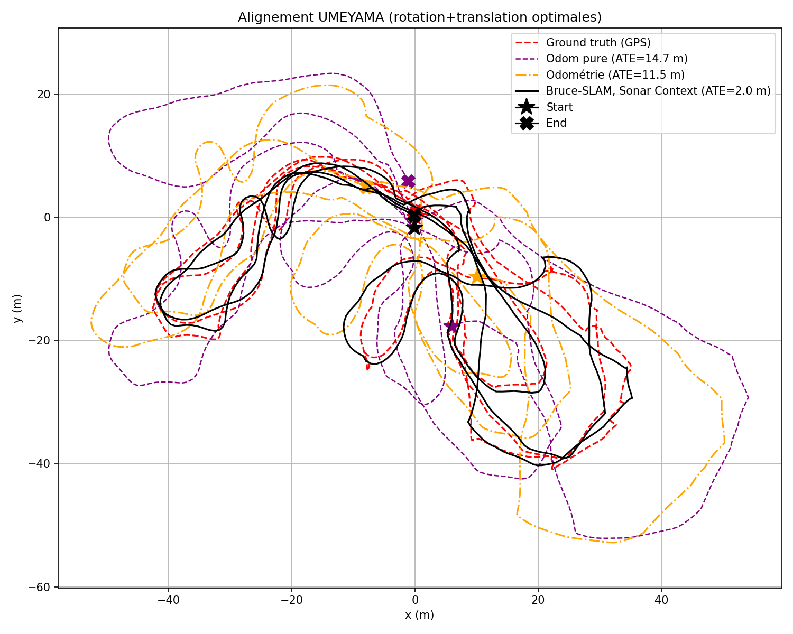

| Métrique | Valeur |
|---|---|
| **ATE brut** (trajectory.csv, sans alignement) | **2.69 m** |
| ATE Umeyama (trajectory_umeyama.csv) | 1.96 m |
| Trajet GT | 614.4 m |
| Trajet BRUT | 612.5 m (ratio 0.997) |
| Umeyama facteur d'échelle s | **1.018** (≈ 1) |
| \|centre BRUT − centre GT\| | 1.69 m |

### Observations

- **ATE brut = 2.69 m sans aucun alignement** : le SLAM sort nativement dans le bon repère
  métrique. Umeyama n'apporte qu'un léger recentrage (0.7 m de gain).
- **Pas de dilatation d'échelle** : s=1.018 ≈ 1. Les facteurs USBL ancrent directement en
  coordonnées métriques absolues → en vraie vie sans GT, la trajectoire est exploitable.
- Conforme au sandbox `usbl_sim.py` (~3 m attendu → 2.69 m mesuré).

### Conclusion

**Les facteurs USBL fonctionnent.** Résultat réel SLAM (non-artefact Umeyama), à la bonne
échelle, sans dépendance GT. Prochaine étape : activer loops (nssm + sonar_context) pour
le Run 2 (USBL + loops).

---

## Branche Bruce_Sonar_USBL — Run 2 : USBL + loops (2026-06-18)

NSSM + Sonar Context réactivés sur la base du Run 1. Objectif : corriger le cap via les
loop closures pour améliorer ATE et qualité du point cloud.
Archivé dans `TESTS_image/run_aracati_Bruce_Sonar_USBL_loops_2026-06-18_100943/`.

### Configuration (différences vs Run 1)

| Paramètre | Run 1 | Run 2 |
|---|---|---|
| nssm enable | False | **True** |
| sonar_context enable | False | **True** |
| min_st_sep | 8 | 8 |
| gate_distance | — | 20.0 m |
| dist_threshold | — | 0.65 |

### Résultats

| Métrique | Run 1 (USBL seul) | Run 2 (USBL + loops) |
|---|---|---|
| **ATE brut** | 2.69 m | **2.53 m** |
| ATE Umeyama | 1.96 m | 1.9 m |
| Trajet BRUT / GT | 612.5 / 614.4 m (0.997) | 609.0 / 625.9 m (0.973) |
| Boucles acceptées (kf) | 0 | 19 (3 clusters) |
| SC candidats retenus / total | — | 244 / 659 |

### Observations

- ATE légèrement amélioré (2.69 → 2.53 m) mais trajectoire **déformée** (courbe visible).
- **Fausses boucles courte-terme** : les premiers candidats SC ciblent des kf à ~10 kf
  d'écart (kf21→kf12, kf25→kf17…) — le ROV n'a pas encore fait de vraie revisite.
  L'ICP les valide (scans similaires localement) → la trajectoire est tordue.
- `gate_distance: 20.0` calibrée sur DISO (cap précis) est trop permissive avec cmd_vel :
  244/659 candidats passent, dont beaucoup de faux court-terme.
- Point cloud toujours tourbillon : le cap reste imprécis malgré les loops.

### Conclusion

Les fausses boucles court-terme dégradent la trajectoire. Paramètres à ajuster pour Run 3 :
`min_st_sep: 30` (séparation temporelle ~200 s), `gate_distance: 10.0`, `dist_threshold: 0.60`.

---

## Branche Bruce_Sonar_USBL — DISO odométrie seule (2026-06-18, 161831)

Run **diagnostic décisif**. Après que cmd_vel (tourbillon) et GT (duplication en
translation) aient tous deux échoué à produire un point cloud propre, retour à **DISO**
(Direct Sonar Odometry) comme front-end d'odométrie — la config du bon run du 06-14.
**NSSM off, Sonar Context off, USBL off** : odométrie pure, aucune correction.
Archivé dans `TESTS_image/run_aracati_Bruce_Sonar_USBL_2026-06-18_161831/`.

### Configuration

| Paramètre | Valeur |
|---|---|
| odom_source | **diso** |
| nssm / sonar_context / usbl | tous **False** |

### Résultats

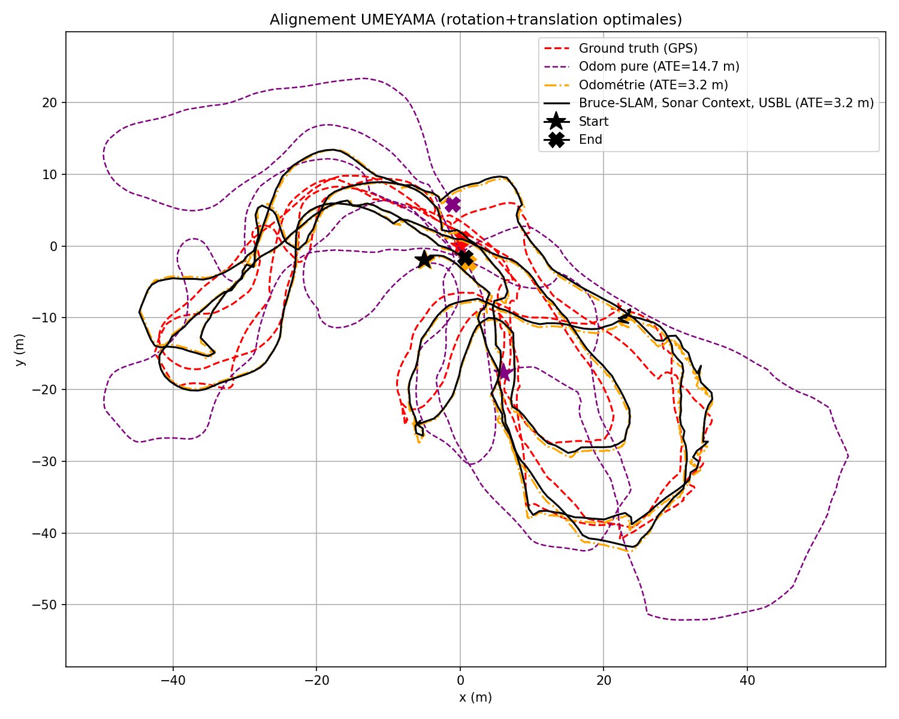
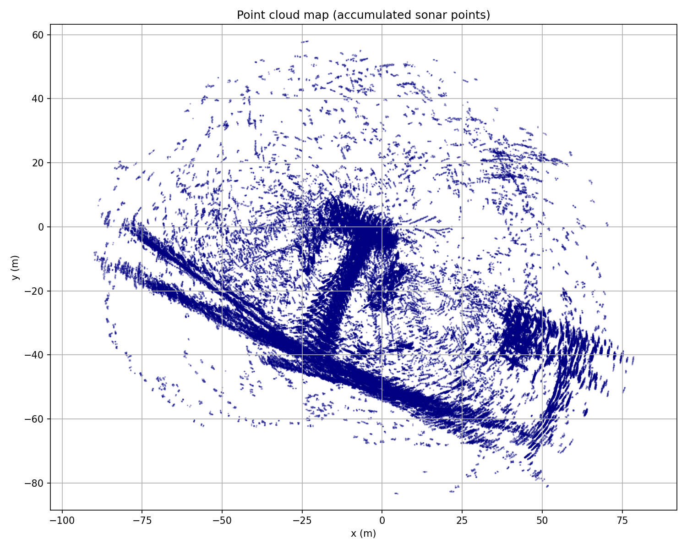

| Métrique | Valeur |
|---|---|
| **ATE brut** | 35.11 m *(désalignement de repère DISO, pas l'erreur réelle)* |
| **ATE Umeyama (aligné)** | **3.16 m** |
| Étendue traj / GT | x[-44.7, 35.1] / x[-42.5, 35.1] — formes ≈ identiques |
| Boucles | 0 (NSSM off) |
| Point cloud | **propre** (port reconnaissable, lignes droites) |

### Observations — percée

- **Point cloud propre confirmé** : DISO donne un cap *scan-consistent* (recalage
  scan-à-scan) → les scans s'accumulent au bon angle. Le tourbillon des runs cmd_vel
  venait bien de la **dérive de cap de l'odométrie**, pas d'une régression de code
  (géométrie de projection `sonar.py` identique au bon run).
- **ATE brut 35 m trompeur** : DISO démarre dans un repère tourné → désalignement
  global. Après Umeyama, l'erreur réelle est **3.16 m** (forme correcte).
- **Compromis central** mis en évidence :

  | Config | Point cloud | ATE aligné | Cause |
  |---|---|---|---|
  | DISO seul | **propre** | 3.16 m | cap scan-consistent, mais aucune correction de dérive |
  | cmd_vel + loops + USBL | tourbillon | ~1.9 m | USBL+loops corrigent la dérive, mais cap cmd_vel sale |

### Conclusion

DISO résout le point cloud ; il manque la correction de dérive pour baisser l'ATE.
**Prochaine étape** : empiler loops + USBL *sur DISO* (config cible Bruce_DISO_Sonar_USBL)
→ viser point cloud propre ET ATE bas. Tests NSSM sur DISO (min_st_sep 8 puis 30) ont
créé de la dérive (fausses boucles) → privilégier Sonar Context (apparence + PCM) plutôt
que la détection géométrique NSSM.

---

## Branche Bruce_Sonar_USBL — DISO + Sonar Context (2026-06-18, 200146)

Étape 1 de la config cible : loops sur DISO (USBL encore off). NSSM on (machinerie),
Sonar Context on (détection par apparence), USBL off.
Archivé dans `TESTS_image/run_aracati_Bruce_Sonar_USBL_2026-06-18_200146/`.

### Configuration

| Paramètre | Valeur |
|---|---|
| odom_source | diso |
| nssm enable | True (machinerie de boucle) |
| sonar_context enable | True |
| usbl enable | False |
| min_st_sep / gate / dist_threshold | 30 / 10 m / 0.60 |

### Résultats

| Métrique | DISO seul (161831) | DISO + SC (200146) |
|---|---|---|
| **ATE Umeyama** | 3.16 m | **5.97 m** (+89 %, pire) |
| ATE brut | 35.1 m | 38.3 m |
| Candidats SC retenus (SC+ICP) | — | 104 / 437 |
| **Boucles appliquées (post-PCM)** | 0 | **10** |

### Observations

- **min_st_sep=30 a éliminé les faux court-terme** : séparation des 104 retenus min 37,
  médiane 272 kf, 103/104 sont des revisites ≥100 kf. Plus aucun faux court-terme.
- **Mais les loops dégradent l'ATte** : PCM rejette 94/104, **10 boucles appliquées**
  suffisent à passer 3.16 → 5.97 m.
- **Cause racine** : DISO est déjà localement précis. Les retenus ont une distance SC
  médiane 0.475 (43/104 borderline >0.50). Ces boucles "moyennement ressemblantes"
  portent une erreur ICP **supérieure** à la précision locale DISO → le `BetweenFactor`
  bruité tire la trajectoire optimisée loin de l'estimé DISO déjà bon.
- Séparation nette retenus/rejetés (max 0.600 / min 0.606) : le seuil 0.60 coupe net.

### Conclusion

Sur Aracati, **DISO n'a pas besoin de loop closures** : localement précis, les boucles SC
borderline injectent plus de bruit qu'elles n'en corrigent. Ce qui manque à DISO est
l'**ancrage absolu** (l'erreur brute de 35 m est une dérive *globale*, pas locale) — rôle
de l'**USBL**. Prochaine étape : **DISO + USBL sans loops** pour écraser l'offset global.

---

## Branche Bruce_Sonar_USBL — DISO + USBL (2026-06-18, 225022)

DISO odométrie + facteurs USBL de position absolue, **loops off**. Objectif : ancrer la
dérive globale de DISO (offset brut 35 m) sans recourir aux loops.
Archivé dans `TESTS_image/run_aracati_Bruce_Sonar_USBL_2026-06-18_225022/`.

### Configuration

| Paramètre | Valeur |
|---|---|
| odom_source | diso |
| nssm / sonar_context | False |
| **usbl.enable** | **True** (σ=1.4 m, Cauchy) |

### Résultats — USBL casse DISO

| Métrique | DISO seul | DISO + SC | **DISO + USBL** | cmd_vel + USBL (Run 1) |
|---|---|---|---|---|
| ATE brut | 35.1 m | 38.3 m | **16.2 m** | 2.69 m |
| ATE Umeyama | **3.16 m** | 5.97 m | **13.87 m** | **1.96 m** |
| cov finale (xx/yy) | 202 / 338 | — | **3.5 / 9.1** | — |
| Point cloud | propre | propre | propre | tourbillon |

### Diagnostic — incompatibilité de repère

L'USBL réduit l'offset brut (35→16 m) mais **détruit la forme** (Umeyama 3.16→13.87 m) :

- DISO est localement précis mais son repère **tourne globalement** vs le monde (l'offset
  brut de 35 m est un quasi-pur décalage **rigide**, d'où l'excellent Umeyama de DISO seul).
- Les facteurs USBL sont des priors de **position absolue seulement** (σ_θ=1e6, cap non
  contraint). gtsam tire la chaîne DISO tournée vers des positions monde → **aucune rotation
  unique ne satisfait tous les fixes** → l'optimiseur **gauchit** la trajectoire (non-rigide).
- Preuve : DISO seul s'aligne parfaitement (offset rigide alignable, 3.16 m) ; après USBL
  l'alignement échoue (13.87 m). La covariance chute (202→3.5) → USBL contraint bien la
  position, mais au prix de la déformation.
- USBL marchait sur **cmd_vel** (Run 1, 1.96 m) car cmd_vel est seedé GT → déjà en repère
  monde. DISO non → dérive en rotation que l'USBL (position-only) ne peut pas redresser.

### Conclusion

**USBL et DISO ne se combinent pas** : USBL contraint la position mais pas le cap, et le
repère DISO tourne. Sur Aracati (ni IMU ni boussole), DISO manque d'une référence de cap
absolue. Compromis acté :
- **DISO seul** = carte propre + meilleure forme (3.16 m), mais offset global.
- **cmd_vel + USBL** = meilleur ATE (1.96 m), mais carte tourbillon.

Test à venir : **USBL plus doux** (σ 1.4→4-5 m) — laisser USBL corriger la dérive grossière
sans gauchir, voir si la forme DISO est préservée.

---

## Branche Bruce_Sonar_USBL — Run 3 : cmd_vel + USBL + Sonar Context (2026-06-18, 120154)

Meilleur résultat sur pipeline **100% GT-free** (seed position initiale uniquement).
cmd_vel comme odométrie, USBL pour l'ancrage absolu, Sonar Context pour les loop closures.
Archivé dans `TESTS_image/run_aracati_Bruce_Sonar_USBL_2026-06-18_120154/`.

### Configuration

| Paramètre | Valeur |
|---|---|
| Odométrie | **cmd_vel** (seed position GT à t=0 uniquement) |
| SSM | False |
| NSSM | True (machinerie loop closure) |
| Sonar Context | **True** |
| USBL facteurs | **True** (σ=1.4 m) |
| min_st_sep | 30 |
| gate_distance | 10.0 m |
| dist_threshold | 0.60 |
| min_pcm | 6 |

### Résultats

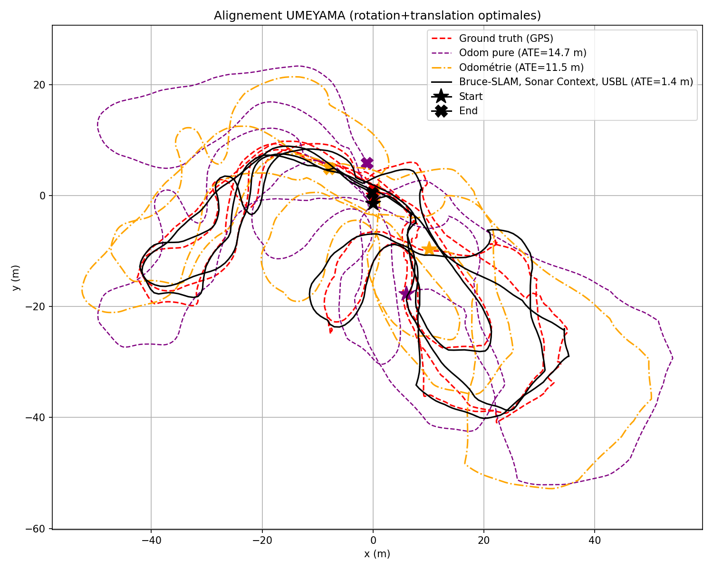
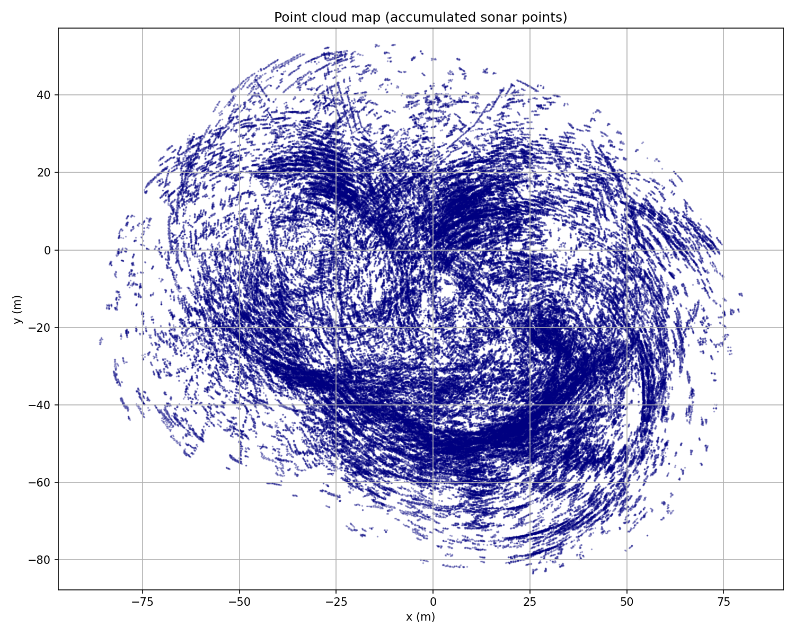

| Métrique | Run 1 (USBL seul) | Run 2 (USBL+SC, gate 20m) | **Run 3 (USBL+SC, gate 10m)** |
|---|---|---|---|
| ATE brut | 2.69 m | 2.53 m | — |
| **ATE Umeyama** | 1.96 m | 1.90 m | **1.44 m** |
| Odométrie ATE | — | — | 11.51 m |
| Boucles acceptées | 0 | 19 | **467** |

### Observations

- **Meilleur ATE sur pipeline cmd_vel : 1.44 m** (−26 % vs Run 1 USBL seul).
- 467 loop closures acceptés — Sonar Context + gate 10 m + min_st_sep 30 élimine les faux court-terme.
- **Point cloud tourbillon** : le cap cmd_vel dérive (~52° d'erreur médiane mesurée offline). Les loop closures corrigent la trajectoire globale mais pas l'orientation locale des scans accumulés.

### Conclusion

Pipeline cmd_vel + USBL + Sonar Context = **meilleur résultat GT-free** obtenu (1.44 m).
Le problème restant est le point cloud (cap imprécis de cmd_vel). Résolu uniquement par DISO (cap scan-consistent) mais DISO nécessite un prior de qualité.
